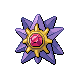

# Trainer Rosters

### Generic Trainers

| Trainer | P1 | P2 | P3 | P4 | P5 | P6 |
|:-------:|:--:|:--:|:--:|:--:|:--:|:--:|
| ](../../assets/trainers/swimmer.png) Swimmer Wesley [(!)](#rematches) |  Floatzel Lv. 59 |  Sharpedo Lv. 59 |  Qwilfish Lv. 59 |
|  Swimmer Ricardo |  Tentacruel Lv. 61 |
| ](../../assets/trainers/swimmer.png) Swimmer Francisco [(!)](#rematches) |  Ludicolo Lv. 59 |  Relicanth Lv. 59 |  Poliwrath Lv. 59 |
|  Swimmer Colton |  Pelipper Lv. 59 |  Octillery Lv. 59 |  Feraligatr Lv. 59 |
|  Swimmer Troy |  Gyarados Lv. 61 |
|  Swimmer Oscar |  Mantine Lv. 59 |  Blastoise Lv. 59 |  Whiscash Lv. 59 |
| ](../../assets/trainers/swimmer.png) Swimmer Miranda [(!)](#rematches) |  Cloyster Lv. 60 |  Lumineon Lv. 60 |
|  Swimmer Aubree |  Bibarel Lv. 60 |  Quagsire Lv. 60 |
|  Swimmer Paige |  Azumarill Lv. 59 |  Slowbro Lv. 59 |  Gorebyss Lv. 59 |
| ](../../assets/trainers/swimmer.png) Swimmer Crystal [(!)](#rematches) |  Wailord Lv. 59 |  Seaking Lv. 59 |  Corsola Lv. 59 |
|  Swimmer Cassandra |  Vaporeon Lv. 61 |
|  Swimmer Gabrielle |  Golduck Lv. 59 |  Lapras Lv. 59 |  Starmie Lv. 59 |
| ](../../assets/trainers/sailor.png) Sailor Zachariah [(!)](#rematches) |  Kingler Lv. 58 |  Machamp Lv. 58 |  Gastrodon Lv. 58 |  Slowking Lv. 58 |

### Rematches

| Trainer | P1 | P2 | P3 | P4 | P5 | P6 |
|:-------:|:--:|:--:|:--:|:--:|:--:|:--:|
|  Swimmer Wesley (S) |  Floatzel Lv. 75 |  Sharpedo Lv. 75 |  Qwilfish Lv. 75 |
|  Swimmer Francisco (S) |  Ludicolo Lv. 75 |  Relicanth Lv. 75 |  Poliwrath Lv. 75 |
|  Swimmer Miranda (S) |  Cloyster Lv. 75 |  Lumineon Lv. 75 |  Starmie Lv. 75 |
|  Swimmer Crystal (S) |  Wailord Lv. 75 |  Seaking Lv. 75 |  Corsola Lv. 75 |
|  Sailor Zachariah (S) |  Kingler Lv. 74 |  Machamp Lv. 74 |  Gastrodon Lv. 74 |  Slowking Lv. 74 |

