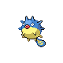

# Trainer Rosters

### Generic Trainers

| Trainer | P1 | P2 | P3 | P4 | P5 | P6 |
|:-------:|:--:|:--:|:--:|:--:|:--:|:--:|
| ](../../assets/trainers/swimmer.png "Swimmer Wesley [(!)](#rematches)") Swimmer Wesley [(!)](#rematches) |  [Floatzel](../../pokemon/floatzel.md/) Lv. 59 |  [Sharpedo](../../pokemon/sharpedo.md/) Lv. 59 |  [Qwilfish](../../pokemon/qwilfish.md/) Lv. 59 |
|  Swimmer Ricardo |  [Tentacruel](../../pokemon/tentacruel.md/) Lv. 61 |
| ](../../assets/trainers/swimmer.png "Swimmer Francisco [(!)](#rematches)") Swimmer Francisco [(!)](#rematches) |  [Ludicolo](../../pokemon/ludicolo.md/) Lv. 59 |  [Relicanth](../../pokemon/relicanth.md/) Lv. 59 |  [Poliwrath](../../pokemon/poliwrath.md/) Lv. 59 |
|  Swimmer Colton |  [Pelipper](../../pokemon/pelipper.md/) Lv. 59 |  [Octillery](../../pokemon/octillery.md/) Lv. 59 |  [Feraligatr](../../pokemon/feraligatr.md/) Lv. 59 |
|  Swimmer Troy |  [Gyarados](../../pokemon/gyarados.md/) Lv. 61 |
|  Swimmer Oscar |  [Mantine](../../pokemon/mantine.md/) Lv. 59 |  [Blastoise](../../pokemon/blastoise.md/) Lv. 59 |  [Whiscash](../../pokemon/whiscash.md/) Lv. 59 |
| ](../../assets/trainers/swimmer.png "Swimmer Miranda [(!)](#rematches)") Swimmer Miranda [(!)](#rematches) |  [Cloyster](../../pokemon/cloyster.md/) Lv. 60 |  [Lumineon](../../pokemon/lumineon.md/) Lv. 60 |
|  Swimmer Aubree |  [Bibarel](../../pokemon/bibarel.md/) Lv. 60 |  [Quagsire](../../pokemon/quagsire.md/) Lv. 60 |
|  Swimmer Paige |  [Azumarill](../../pokemon/azumarill.md/) Lv. 59 |  [Slowbro](../../pokemon/slowbro.md/) Lv. 59 |  [Gorebyss](../../pokemon/gorebyss.md/) Lv. 59 |
| ](../../assets/trainers/swimmer.png "Swimmer Crystal [(!)](#rematches)") Swimmer Crystal [(!)](#rematches) |  [Wailord](../../pokemon/wailord.md/) Lv. 59 |  [Seaking](../../pokemon/seaking.md/) Lv. 59 |  [Corsola](../../pokemon/corsola.md/) Lv. 59 |
|  Swimmer Cassandra |  [Vaporeon](../../pokemon/vaporeon.md/) Lv. 61 |
|  Swimmer Gabrielle |  [Golduck](../../pokemon/golduck.md/) Lv. 59 |  [Lapras](../../pokemon/lapras.md/) Lv. 59 |  [Starmie](../../pokemon/starmie.md/) Lv. 59 |
| ](../../assets/trainers/sailor.png "Sailor Zachariah [(!)](#rematches)") Sailor Zachariah [(!)](#rematches) |  [Kingler](../../pokemon/kingler.md/) Lv. 58 |  [Machamp](../../pokemon/machamp.md/) Lv. 58 |  [Gastrodon](../../pokemon/gastrodon.md/) Lv. 58 |  [Slowking](../../pokemon/slowking.md/) Lv. 58 |

### Rematches

| Trainer | P1 | P2 | P3 | P4 | P5 | P6 |
|:-------:|:--:|:--:|:--:|:--:|:--:|:--:|
| ") Swimmer Wesley (S) |  [Floatzel](../../pokemon/floatzel.md/) Lv. 75 |  [Sharpedo](../../pokemon/sharpedo.md/) Lv. 75 |  [Qwilfish](../../pokemon/qwilfish.md/) Lv. 75 |
| ") Swimmer Francisco (S) |  [Ludicolo](../../pokemon/ludicolo.md/) Lv. 75 |  [Relicanth](../../pokemon/relicanth.md/) Lv. 75 |  [Poliwrath](../../pokemon/poliwrath.md/) Lv. 75 |
| ") Swimmer Miranda (S) |  [Cloyster](../../pokemon/cloyster.md/) Lv. 75 |  [Lumineon](../../pokemon/lumineon.md/) Lv. 75 |  [Starmie](../../pokemon/starmie.md/) Lv. 75 |
| ") Swimmer Crystal (S) |  [Wailord](../../pokemon/wailord.md/) Lv. 75 |  [Seaking](../../pokemon/seaking.md/) Lv. 75 |  [Corsola](../../pokemon/corsola.md/) Lv. 75 |
| ") Sailor Zachariah (S) |  [Kingler](../../pokemon/kingler.md/) Lv. 74 |  [Machamp](../../pokemon/machamp.md/) Lv. 74 |  [Gastrodon](../../pokemon/gastrodon.md/) Lv. 74 |  [Slowking](../../pokemon/slowking.md/) Lv. 74 |

