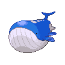

# Route 223 — Wild Pokémon

### Surfing

| Sprite | Pokémon | Encounter Type | Level | Chance |
|:------:|---------|:--------------:|-------|--------|
|  | [Tentacruel](../../pokemon/tentacruel.md/) | {: style='max-width: 24px;' } | 50 - 60 | 60% |
|  | [Pelipper](../../pokemon/pelipper.md/) | {: style='max-width: 24px;' } | 50 - 60 | 30% |
|  | [Mantine](../../pokemon/mantine.md/) | {: style='max-width: 24px;' } | 50 - 60 | 10% |

### Fishing

| Sprite | Pokémon | Encounter Type | Level | Chance |
|:------:|---------|:--------------:|-------|--------|
|  | [Magikarp](../../pokemon/magikarp.md/) | {: style='max-width: 24px;' } | 10 | 60% |
|  | [Remoraid](../../pokemon/remoraid.md/) | {: style='max-width: 24px;' } | 10 | 30% |
|  | [Wailmer](../../pokemon/wailmer.md/) | {: style='max-width: 24px;' } | 10 | 10% |
|  | [Magikarp](../../pokemon/magikarp.md/) | {: style='max-width: 24px;' } | 25 | 60% |
|  | [Remoraid](../../pokemon/remoraid.md/) | {: style='max-width: 24px;' } | 25 | 30% |
|  | [Wailmer](../../pokemon/wailmer.md/) | {: style='max-width: 24px;' } | 25 | 10% |
|  | [Gyarados](../../pokemon/gyarados.md/) | {: style='max-width: 24px;' } | 50 | 60% |
|  | [Wailmer](../../pokemon/wailmer.md/) | {: style='max-width: 24px;' } | 50 | 30% |
|  | [Octillery](../../pokemon/octillery.md/) | {: style='max-width: 24px;' } | 50 | 5% |
|  | [Wailord](../../pokemon/wailord.md/) | {: style='max-width: 24px;' } | 50 | 5% |

