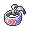

# Important Trainers

### PKMN Trainer Dawn

=== "Turtwig"

	| Pokémon | Attributes | Item | Moves |
	|:-------:|------------|:----:|-------|
	|  | **Lv. 69** [Alakazam](../../pokemon/alakazam.md/) **Ability:** Magic Guard **Nature:** ? |  Life Orb | 1. Psychic 2. Shadow Ball 3. Aura Sphere 4. Dazzling Gleam |
	|  | **Lv. 69** [Mamoswine](../../pokemon/mamoswine.md/) **Ability:** Thick Fat **Nature:** ? |  Choice Band | 1. Earthquake 2. Icicle Crash 3. Stone Edge 4. Superpower |
	|  | **Lv. 69** [Clefable](../../pokemon/clefable.md/) **Ability:** Cute Charm **Nature:** ? |  Leftovers | 1. Moonblast 2. Soft-Boiled 3. Calm Mind 4. Flamethrower |
	|  | **Lv. 69** [Lopunny](../../pokemon/lopunny.md/) **Ability:** Scrappy **Nature:** ? |  Focus Sash | 1. Mega Kick 2. High Jump Kick 3. Fake Out 4. Agility |
	|  | **Lv. 69** [Vaporeon](../../pokemon/vaporeon.md/) **Ability:** Water Absorb **Nature:** ? |  Wacan Berry | 1. Muddy Water 2. Ice Beam 3. Rest 4. Sleep Talk |
	|  | **Lv. 70** [Torterra](../../pokemon/torterra.md/) **Ability:** Overgrow **Nature:** ? |  Sitrus Berry | 1. Frenzy Plant 2. Earthquake 3. Stone Edge 4. Iron Head |
	
=== "Chimchar"

	| Pokémon | Attributes | Item | Moves |
	|:-------:|------------|:----:|-------|
	|  | **Lv. 69** [Alakazam](../../pokemon/alakazam.md/) **Ability:** Magic Guard **Nature:** ? |  Life Orb | 1. Psychic 2. Shadow Ball 3. Aura Sphere 4. Dazzling Gleam |
	|  | **Lv. 69** [Mamoswine](../../pokemon/mamoswine.md/) **Ability:** Thick Fat **Nature:** ? |  Choice Band | 1. Earthquake 2. Icicle Crash 3. Stone Edge 4. Superpower |
	|  | **Lv. 69** [Clefable](../../pokemon/clefable.md/) **Ability:** Cute Charm **Nature:** ? |  Leftovers | 1. Moonblast 2. Soft-Boiled 3. Calm Mind 4. Flamethrower |
	|  | **Lv. 69** [Lopunny](../../pokemon/lopunny.md/) **Ability:** Scrappy **Nature:** ? |  Focus Sash | 1. Mega Kick 2. High Jump Kick 3. Fake Out 4. Agility |
	|  | **Lv. 69** [Jolteon](../../pokemon/jolteon.md/) **Ability:** Volt Absorb **Nature:** ? |  Shuca Berry | 1. Thunderbolt 2. Grass Knot 3. Shadow Ball 4. Thunder Wave |
	|  | **Lv. 70** [Infernape](../../pokemon/infernape.md/) **Ability:** Iron Fist **Nature:** ? |  Sitrus Berry | 1. Blast Burn 2. Close Combat 3. Stone Edge 4. Thunder Punch |
	
=== "Piplup"

	| Pokémon | Attributes | Item | Moves |
	|:-------:|------------|:----:|-------|
	|  | **Lv. 69** [Alakazam](../../pokemon/alakazam.md/) **Ability:** Magic Guard **Nature:** ? |  Life Orb | 1. Psychic 2. Shadow Ball 3. Aura Sphere 4. Dazzling Gleam |
	|  | **Lv. 69** [Mamoswine](../../pokemon/mamoswine.md/) **Ability:** Thick Fat **Nature:** ? |  Choice Band | 1. Earthquake 2. Icicle Crash 3. Stone Edge 4. Superpower |
	|  | **Lv. 69** [Clefable](../../pokemon/clefable.md/) **Ability:** Cute Charm **Nature:** ? |  Leftovers | 1. Moonblast 2. Soft-Boiled 3. Calm Mind 4. Flamethrower |
	|  | **Lv. 69** [Lopunny](../../pokemon/lopunny.md/) **Ability:** Scrappy **Nature:** ? |  Focus Sash | 1. Mega Kick 2. High Jump Kick 3. Fake Out 4. Agility |
	|  | **Lv. 69** [Flareon](../../pokemon/flareon.md/) **Ability:** Flash Fire **Nature:** ? |  Passho Berry | 1. Flare Blitz 2. Play Rough 3. Close Combat 4. Wild Charge |
	|  | **Lv. 70** [Empoleon](../../pokemon/empoleon.md/) **Ability:** Torrent **Nature:** ? |  Sitrus Berry | 1. Hydro Cannon 2. Flash Cannon 3. Grass Knot 4. Ice Beam |
	
### PKMN Trainer Lucas

=== "Turtwig"

	| Pokémon | Attributes | Item | Moves |
	|:-------:|------------|:----:|-------|
	|  | **Lv. 69** [Alakazam](../../pokemon/alakazam.md/) **Ability:** Magic Guard **Nature:** ? |  Life Orb | 1. Psychic 2. Shadow Ball 3. Aura Sphere 4. Dazzling Gleam |
	|  | **Lv. 69** [Mamoswine](../../pokemon/mamoswine.md/) **Ability:** Thick Fat **Nature:** ? |  Choice Band | 1. Earthquake 2. Icicle Crash 3. Stone Edge 4. Superpower |
	|  | **Lv. 69** [Granbull](../../pokemon/granbull.md/) **Ability:** Intimidate **Nature:** ? |  Muscle Band | 1. Play Rough 2. Close Combat 3. Crunch 4. Earthquake |
	|  | **Lv. 69** [Lickilicky](../../pokemon/lickilicky.md/) **Ability:** Own Tempo **Nature:** ? |  Leftovers | 1. Double-Edge 2. Earthquake 3. Hammer Arm 4. Swords Dance |
	|  | **Lv. 69** [Vaporeon](../../pokemon/vaporeon.md/) **Ability:** Water Absorb **Nature:** ? |  Wacan Berry | 1. Muddy Water 2. Ice Beam 3. Rest 4. Sleep Talk |
	|  | **Lv. 70** [Torterra](../../pokemon/torterra.md/) **Ability:** Overgrow **Nature:** ? |  Sitrus Berry | 1. Frenzy Plant 2. Earthquake 3. Stone Edge 4. Iron Head |
	
=== "Chimchar"

	| Pokémon | Attributes | Item | Moves |
	|:-------:|------------|:----:|-------|
	|  | **Lv. 69** [Alakazam](../../pokemon/alakazam.md/) **Ability:** Magic Guard **Nature:** ? |  Life Orb | 1. Psychic 2. Shadow Ball 3. Aura Sphere 4. Dazzling Gleam |
	|  | **Lv. 69** [Mamoswine](../../pokemon/mamoswine.md/) **Ability:** Thick Fat **Nature:** ? |  Choice Band | 1. Earthquake 2. Icicle Crash 3. Stone Edge 4. Superpower |
	|  | **Lv. 69** [Granbull](../../pokemon/granbull.md/) **Ability:** Intimidate **Nature:** ? |  Muscle Band | 1. Play Rough 2. Close Combat 3. Crunch 4. Earthquake |
	|  | **Lv. 69** [Lickilicky](../../pokemon/lickilicky.md/) **Ability:** Own Tempo **Nature:** ? |  Leftovers | 1. Double-Edge 2. Earthquake 3. Hammer Arm 4. Swords Dance |
	|  | **Lv. 69** [Jolteon](../../pokemon/jolteon.md/) **Ability:** Volt Absorb **Nature:** ? |  Shuca Berry | 1. Thunderbolt 2. Grass Knot 3. Shadow Ball 4. Thunder Wave |
	|  | **Lv. 70** [Infernape](../../pokemon/infernape.md/) **Ability:** Iron Fist **Nature:** ? |  Sitrus Berry | 1. Blast Burn 2. Close Combat 3. Stone Edge 4. Thunder Punch |
	
=== "Piplup"

	| Pokémon | Attributes | Item | Moves |
	|:-------:|------------|:----:|-------|
	|  | **Lv. 69** [Alakazam](../../pokemon/alakazam.md/) **Ability:** Magic Guard **Nature:** ? |  Life Orb | 1. Psychic 2. Shadow Ball 3. Aura Sphere 4. Dazzling Gleam |
	|  | **Lv. 69** [Mamoswine](../../pokemon/mamoswine.md/) **Ability:** Thick Fat **Nature:** ? |  Choice Band | 1. Earthquake 2. Icicle Crash 3. Stone Edge 4. Superpower |
	|  | **Lv. 69** [Granbull](../../pokemon/granbull.md/) **Ability:** Intimidate **Nature:** ? |  Muscle Band | 1. Play Rough 2. Close Combat 3. Crunch 4. Earthquake |
	|  | **Lv. 69** [Lickilicky](../../pokemon/lickilicky.md/) **Ability:** Own Tempo **Nature:** ? |  Leftovers | 1. Double-Edge 2. Earthquake 3. Hammer Arm 4. Swords Dance |
	|  | **Lv. 69** [Flareon](../../pokemon/flareon.md/) **Ability:** Flash Fire **Nature:** ? |  Passho Berry | 1. Flare Blitz 2. Play Rough 3. Close Combat 4. Wild Charge |
	|  | **Lv. 70** [Empoleon](../../pokemon/empoleon.md/) **Ability:** Torrent **Nature:** ? |  Sitrus Berry | 1. Hydro Cannon 2. Flash Cannon 3. Grass Knot 4. Ice Beam |
	
