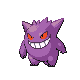

# Route 224 — Trainer Rosters

### Generic Trainers

| Trainer | P1 | P2 | P3 | P4 | P5 | P6 |
|:-------:|:--:|:--:|:--:|:--:|:--:|:--:|
|  Ace Trainer Ruben |  [Shiftry](../../pokemon/shiftry.md/) Lv. 67 |  [Gyarados](../../pokemon/gyarados.md/) Lv. 67 |  [Politoed](../../pokemon/politoed.md/) Lv. 67 |  [Leafeon](../../pokemon/leafeon.md/) Lv. 67 |
|  Psychic Brittney |  [Hypno](../../pokemon/hypno.md/) Lv. 66 |  [Alakazam](../../pokemon/alakazam.md/) Lv. 66 |  [Medicham](../../pokemon/medicham.md/) Lv. 66 |  [Lunatone](../../pokemon/lunatone.md/) Lv. 66 |
|  Psychic Maxwell |  [Mismagius](../../pokemon/mismagius.md/) Lv. 66 |  [Gengar](../../pokemon/gengar.md/) Lv. 66 |  [Slowbro](../../pokemon/slowbro.md/) Lv. 66 |  [Solrock](../../pokemon/solrock.md/) Lv. 66 |
| ") Veteran Armando [(!)](#rematches) |  [Muk](../../pokemon/muk.md/) Lv. 68 |  [Mightyena](../../pokemon/mightyena.md/) Lv. 68 |  [Lickilicky](../../pokemon/lickilicky.md/) Lv. 68 |  [Pelipper](../../pokemon/pelipper.md/) Lv. 68 |
|  Black Belt Carl |  [Hariyama](../../pokemon/hariyama.md/) Lv. 66 |  [Hitmonlee](../../pokemon/hitmonlee.md/) Lv. 66 |  [Hitmonchan](../../pokemon/hitmonchan.md/) Lv. 66 |  [Hitmontop](../../pokemon/hitmontop.md/) Lv. 66 |
|  Ruin Maniac Larry |  [Aerodactyl](../../pokemon/aerodactyl.md/) Lv. 66 |  [Armaldo](../../pokemon/armaldo.md/) Lv. 66 |  [Cradily](../../pokemon/cradily.md/) Lv. 66 |  [Relicanth](../../pokemon/relicanth.md/) Lv. 66 |
|  Ace Trainer Jamie |  [Vaporeon](../../pokemon/vaporeon.md/) Lv. 67 |  [Metagross](../../pokemon/metagross.md/) Lv. 67 |  [Roserade](../../pokemon/roserade.md/) Lv. 67 |  [Dugtrio](../../pokemon/dugtrio.md/) Lv. 67 |
| ") Dragon Tamer Hayden [(!)](#rematches) |  [Altaria](../../pokemon/altaria.md/) Lv. 67 |  [Salamence](../../pokemon/salamence.md/) Lv. 67 |  [Kingdra](../../pokemon/kingdra.md/) Lv. 67 |  [Dragonite](../../pokemon/dragonite.md/) Lv. 67 |

### Rematches

| Trainer | P1 | P2 | P3 | P4 | P5 | P6 |
|:-------:|:--:|:--:|:--:|:--:|:--:|:--:|
| ") Veteran Armando (S) |  [Muk](../../pokemon/muk.md/) Lv. 77 |  [Mightyena](../../pokemon/mightyena.md/) Lv. 77 |  [Lickilicky](../../pokemon/lickilicky.md/) Lv. 77 |  [Pelipper](../../pokemon/pelipper.md/) Lv. 77 |
| ") Dragon Tamer Hayden (S) |  [Altaria](../../pokemon/altaria.md/) Lv. 77 |  [Salamence](../../pokemon/salamence.md/) Lv. 77 |  [Kingdra](../../pokemon/kingdra.md/) Lv. 77 |  [Dragonite](../../pokemon/dragonite.md/) Lv. 77 |

### Important Trainers

1. [PKMN Trainer Dawn](important_trainers.md#pkmn-trainer-dawn)
1. [PKMN Trainer Lucas](important_trainers.md#pkmn-trainer-lucas)
