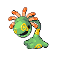
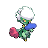

# Trainer Rosters

### Generic Trainers

| Trainer | P1 | P2 | P3 | P4 | P5 | P6 |
|:-------:|:--:|:--:|:--:|:--:|:--:|:--:|
|  Ace Trainer Ruben |  Shiftry Lv. 67 |  Gyarados Lv. 67 |  Politoed Lv. 67 |  Leafeon Lv. 67 |
|  Psychic Brittney |  Hypno Lv. 66 |  Alakazam Lv. 66 |  Medicham Lv. 66 |  Lunatone Lv. 66 |
|  Psychic Maxwell |  Mismagius Lv. 66 |  Gengar Lv. 66 |  Slowbro Lv. 66 |  Solrock Lv. 66 |
| ](../../assets/trainers/veteran.png "Veteran Armando [(!)](#rematches)") Veteran Armando [(!)](#rematches) |  Muk Lv. 68 |  Mightyena Lv. 68 |  Lickilicky Lv. 68 |  Pelipper Lv. 68 |
|  Black Belt Carl |  Hariyama Lv. 66 |  Hitmonlee Lv. 66 |  Hitmonchan Lv. 66 |  Hitmontop Lv. 66 |
|  Ruin Maniac Larry |  Aerodactyl Lv. 66 |  Armaldo Lv. 66 |  Cradily Lv. 66 |  Relicanth Lv. 66 |
|  Ace Trainer Jamie |  Vaporeon Lv. 67 |  Metagross Lv. 67 |  Roserade Lv. 67 |  Dugtrio Lv. 67 |
| ](../../assets/trainers/dragon_tamer.png "Dragon Tamer Hayden [(!)](#rematches)") Dragon Tamer Hayden [(!)](#rematches) |  Altaria Lv. 67 |  Salamence Lv. 67 |  Kingdra Lv. 67 |  Dragonite Lv. 67 |

### Rematches

| Trainer | P1 | P2 | P3 | P4 | P5 | P6 |
|:-------:|:--:|:--:|:--:|:--:|:--:|:--:|
| ") Veteran Armando (S) |  Muk Lv. 77 |  Mightyena Lv. 77 |  Lickilicky Lv. 77 |  Pelipper Lv. 77 |
| ") Dragon Tamer Hayden (S) |  Altaria Lv. 77 |  Salamence Lv. 77 |  Kingdra Lv. 77 |  Dragonite Lv. 77 |

### Important Trainers

1. [PKMN Trainer Dawn](important_trainers.md#pkmn-trainer-dawn)
1. [PKMN Trainer Lucas](important_trainers.md#pkmn-trainer-lucas)
