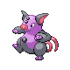

# Route 225 — Wild Pokémon

### Walking

| Sprite | Pokémon | Encounter Type | Level | Chance |
|:------:|---------|:--------------:|-------|--------|
|  | [Fearow](../../pokemon/fearow.md/) | {: style='max-width: 24px;' } | 65 - 67 | 20% |
|  | [Machoke](../../pokemon/machoke.md/) | {: style='max-width: 24px;' } | 65 - 67 | 20% |
|  | [Graveler](../../pokemon/graveler.md/) | {: style='max-width: 24px;' } | 65 - 67 | 20% |
|  | [Raticate](../../pokemon/raticate.md/) | {: style='max-width: 24px;' } | 65 - 67 | 15% |
|  | [Primeape](../../pokemon/primeape.md/) | {: style='max-width: 24px;' } | 65 - 67 | 15% |
|  | [Hariyama](../../pokemon/hariyama.md/) | {: style='max-width: 24px;' } | 65 - 67 | 5% |
|  | [Grumpig](../../pokemon/grumpig.md/) | {: style='max-width: 24px;' } | 65 - 67 | 5% |
|  | [Fearow](../../pokemon/fearow.md/) | {: style='max-width: 24px;' } | 65 - 67 | 20% |
|  | [Machoke](../../pokemon/machoke.md/) | {: style='max-width: 24px;' } | 65 - 67 | 20% |
|  | [Graveler](../../pokemon/graveler.md/) | {: style='max-width: 24px;' } | 65 - 67 | 20% |
|  | [Raticate](../../pokemon/raticate.md/) | {: style='max-width: 24px;' } | 65 - 67 | 15% |
|  | [Primeape](../../pokemon/primeape.md/) | {: style='max-width: 24px;' } | 65 - 67 | 15% |
|  | [Hariyama](../../pokemon/hariyama.md/) | {: style='max-width: 24px;' } | 65 - 67 | 5% |
|  | [Grumpig](../../pokemon/grumpig.md/) | {: style='max-width: 24px;' } | 65 - 67 | 5% |
|  | [Fearow](../../pokemon/fearow.md/) | {: style='max-width: 24px;' } | 65 - 67 | 20% |
|  | [Machoke](../../pokemon/machoke.md/) | {: style='max-width: 24px;' } | 65 - 67 | 20% |
|  | [Graveler](../../pokemon/graveler.md/) | {: style='max-width: 24px;' } | 65 - 67 | 20% |
|  | [Raticate](../../pokemon/raticate.md/) | {: style='max-width: 24px;' } | 65 - 67 | 15% |
|  | [Primeape](../../pokemon/primeape.md/) | {: style='max-width: 24px;' } | 65 - 67 | 15% |
|  | [Hariyama](../../pokemon/hariyama.md/) | {: style='max-width: 24px;' } | 65 - 67 | 5% |
|  | [Grumpig](../../pokemon/grumpig.md/) | {: style='max-width: 24px;' } | 65 - 67 | 5% |

### Surfing

| Sprite | Pokémon | Encounter Type | Level | Chance |
|:------:|---------|:--------------:|-------|--------|
|  | [Poliwhirl](../../pokemon/poliwhirl.md/) | {: style='max-width: 24px;' } | 65 - 67 | 60% |
|  | [Golduck](../../pokemon/golduck.md/) | {: style='max-width: 24px;' } | 65 - 67 | 40% |

### Fishing

| Sprite | Pokémon | Encounter Type | Level | Chance |
|:------:|---------|:--------------:|-------|--------|
|  | [Magikarp](../../pokemon/magikarp.md/) | {: style='max-width: 24px;' } | 10 | 65% |
|  | [Barboach](../../pokemon/barboach.md/) | {: style='max-width: 24px;' } | 10 | 35% |
|  | [Magikarp](../../pokemon/magikarp.md/) | {: style='max-width: 24px;' } | 25 | 65% |
|  | [Barboach](../../pokemon/barboach.md/) | {: style='max-width: 24px;' } | 25 | 35% |
|  | [Gyarados](../../pokemon/gyarados.md/) | {: style='max-width: 24px;' } | 50 | 65% |
|  | [Whiscash](../../pokemon/whiscash.md/) | {: style='max-width: 24px;' } | 50 | 35% |

