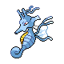
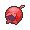
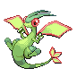
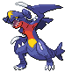

# Important Trainers

### Ace Trainer Wyver

| Pokémon | Attributes | Item | Moves |
|:-------:|------------|:----:|-------|
|  | **Lv. 76** Kingdra **Ability:** Swift Swim ? |  Haban Berry | **1.** Waterfall **2.** Outrage **3.** Yawn **4.** Dragon Dance |
|  | **Lv. 76** Flygon **Ability:** Compound Eyes (!) ? |  White Herb | **1.** Draco Meteor **2.** Earth Power **3.** Bug Buzz **4.** Fire Blast |
|  | **Lv. 76** Altaria **Ability:** Cloud Nine ? |  Leftovers | **1.** Dragon Claw **2.** Toxic **3.** Rest **4.** Sleep Talk |
|  | **Lv. 76** Dragonite **Ability:** Marvel Scale (!) ? |  Sitrus Berry | **1.** Outrage **2.** Earthquake **3.** Extreme Speed **4.** Iron Tail |
|  | **Lv. 76** Garchomp **Ability:** Rough Skin ? |  Choice Scarf | **1.** Outrage **2.** Earthquake **3.** Poison Jab **4.** Fire Fang |
|  | **Lv. 77** Salamence **Ability:** Intimidate ? |  Focus Sash | **1.** Outrage **2.** Aerial Ace **3.** Dragon Dance **4.** Earthquake |

