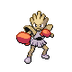

# Route 226 — Trainer Rosters

### Generic Trainers

| Trainer | P1 | P2 | P3 | P4 | P5 | P6 |
|:-------:|:--:|:--:|:--:|:--:|:--:|:--:|
|  Swimmer Lydia |  [Azumarill](../../pokemon/azumarill.md/) Lv. 73 |  [Dewgong](../../pokemon/dewgong.md/) Lv. 73 |  [Wailord](../../pokemon/wailord.md/) Lv. 73 |
|  Ace Trainer Graham |  [Tyrogue](../../pokemon/tyrogue.md/) Lv. 74 |  [Hitmonchan](../../pokemon/hitmonchan.md/) Lv. 74 |  [Hitmonlee](../../pokemon/hitmonlee.md/) Lv. 74 |  [Hitmontop](../../pokemon/hitmontop.md/) Lv. 74 |
|  Bird Keeper Geneva |  [Fearow](../../pokemon/fearow.md/) Lv. 74 |  [Xatu](../../pokemon/xatu.md/) Lv. 74 |  [Swellow](../../pokemon/swellow.md/) Lv. 74 |
|  Dragon Tamer Stanley |  [Kingdra](../../pokemon/kingdra.md/) Lv. 76 |
|  Swimmer Wade |  [Sharpedo](../../pokemon/sharpedo.md/) Lv. 74 |  [Whiscash](../../pokemon/whiscash.md/) Lv. 74 |
|  Ace Trainer Wyver * |  [Kingdra](../../pokemon/kingdra.md/) Lv. 76 |  [Flygon](../../pokemon/flygon.md/) Lv. 76 |  [Altaria](../../pokemon/altaria.md/) Lv. 76 |  [Dragonite](../../pokemon/dragonite.md/) Lv. 76 |  [Garchomp](../../pokemon/garchomp.md/) Lv. 76 |  [Salamence](../../pokemon/salamence.md/) Lv. 77 |

### Important Trainers

1. [Ace Trainer Wyver](important_trainers.md#ace-trainer-wyver)
