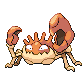

# Route 226 — Wild Pokémon

### Walking

| Sprite | Pokémon | Encounter Type | Level | Chance |
|:------:|---------|:--------------:|-------|--------|
|  | [Raticate](../../pokemon/raticate.md/) | {: style='max-width: 24px;' } | 65 - 67 | 20% |
|  | [Fearow](../../pokemon/fearow.md/) | {: style='max-width: 24px;' } | 65 - 67 | 20% |
|  | [Arbok](../../pokemon/arbok.md/) | {: style='max-width: 24px;' } | 65 - 67 | 15% |
|  | [Sandslash](../../pokemon/sandslash.md/) | {: style='max-width: 24px;' } | 65 - 67 | 15% |
|  | [Rapidash](../../pokemon/rapidash.md/) | {: style='max-width: 24px;' } | 65 - 67 | 10% |
|  | [Dodrio](../../pokemon/dodrio.md/) | {: style='max-width: 24px;' } | 65 - 67 | 10% |
|  | [Kingler](../../pokemon/kingler.md/) | {: style='max-width: 24px;' } | 65 - 67 | 10% |
|  | [Raticate](../../pokemon/raticate.md/) | {: style='max-width: 24px;' } | 65 - 67 | 20% |
|  | [Fearow](../../pokemon/fearow.md/) | {: style='max-width: 24px;' } | 65 - 67 | 20% |
|  | [Arbok](../../pokemon/arbok.md/) | {: style='max-width: 24px;' } | 65 - 67 | 15% |
|  | [Sandslash](../../pokemon/sandslash.md/) | {: style='max-width: 24px;' } | 65 - 67 | 15% |
|  | [Rapidash](../../pokemon/rapidash.md/) | {: style='max-width: 24px;' } | 65 - 67 | 10% |
|  | [Dodrio](../../pokemon/dodrio.md/) | {: style='max-width: 24px;' } | 65 - 67 | 10% |
|  | [Kingler](../../pokemon/kingler.md/) | {: style='max-width: 24px;' } | 65 - 67 | 10% |
|  | [Raticate](../../pokemon/raticate.md/) | {: style='max-width: 24px;' } | 65 - 67 | 20% |
|  | [Fearow](../../pokemon/fearow.md/) | {: style='max-width: 24px;' } | 65 - 67 | 20% |
|  | [Arbok](../../pokemon/arbok.md/) | {: style='max-width: 24px;' } | 65 - 67 | 15% |
|  | [Sandslash](../../pokemon/sandslash.md/) | {: style='max-width: 24px;' } | 65 - 67 | 15% |
|  | [Rapidash](../../pokemon/rapidash.md/) | {: style='max-width: 24px;' } | 65 - 67 | 10% |
|  | [Dodrio](../../pokemon/dodrio.md/) | {: style='max-width: 24px;' } | 65 - 67 | 10% |
|  | [Kingler](../../pokemon/kingler.md/) | {: style='max-width: 24px;' } | 65 - 67 | 10% |

### Surfing

| Sprite | Pokémon | Encounter Type | Level | Chance |
|:------:|---------|:--------------:|-------|--------|
|  | [Pelipper](../../pokemon/pelipper.md/) | {: style='max-width: 24px;' } | 65 - 67 | 60% |
|  | [Tentacruel](../../pokemon/tentacruel.md/) | {: style='max-width: 24px;' } | 65 - 67 | 40% |

### Fishing

| Sprite | Pokémon | Encounter Type | Level | Chance |
|:------:|---------|:--------------:|-------|--------|
|  | [Magikarp](../../pokemon/magikarp.md/) | {: style='max-width: 24px;' } | 10 | 60% |
|  | [Horsea](../../pokemon/horsea.md/) | {: style='max-width: 24px;' } | 10 | 30% |
|  | [Relicanth](../../pokemon/relicanth.md/) | {: style='max-width: 24px;' } | 10 | 10% |
|  | [Magikarp](../../pokemon/magikarp.md/) | {: style='max-width: 24px;' } | 25 | 60% |
|  | [Horsea](../../pokemon/horsea.md/) | {: style='max-width: 24px;' } | 25 | 30% |
|  | [Relicanth](../../pokemon/relicanth.md/) | {: style='max-width: 24px;' } | 25 | 10% |
|  | [Gyarados](../../pokemon/gyarados.md/) | {: style='max-width: 24px;' } | 50 | 60% |
|  | [Seadra](../../pokemon/seadra.md/) | {: style='max-width: 24px;' } | 50 | 30% |
|  | [Relicanth](../../pokemon/relicanth.md/) | {: style='max-width: 24px;' } | 50 | 10% |

