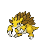

### Morning

| Sprite | Pokémon | Encounter Type | Level | Chance |
|:------:|---------|:--------------:|-------|--------|
|  | Raticate | {: style='max-width: 24px;' } | 65 - 67 | 20% |
|  | Fearow | {: style='max-width: 24px;' } | 65 - 67 | 20% |
|  | Arbok | {: style='max-width: 24px;' } | 65 - 67 | 15% |
|  | Sandslash | {: style='max-width: 24px;' } | 65 - 67 | 15% |
|  | Rapidash | {: style='max-width: 24px;' } | 65 - 67 | 10% |
|  | Dodrio | {: style='max-width: 24px;' } | 65 - 67 | 10% |
|  | Kingler | {: style='max-width: 24px;' } | 65 - 67 | 10% |

### Day

| Sprite | Pokémon | Encounter Type | Level | Chance |
|:------:|---------|:--------------:|-------|--------|
|  | Raticate | {: style='max-width: 24px;' } | 65 - 67 | 20% |
|  | Fearow | {: style='max-width: 24px;' } | 65 - 67 | 20% |
|  | Arbok | {: style='max-width: 24px;' } | 65 - 67 | 15% |
|  | Sandslash | {: style='max-width: 24px;' } | 65 - 67 | 15% |
|  | Rapidash | {: style='max-width: 24px;' } | 65 - 67 | 10% |
|  | Dodrio | {: style='max-width: 24px;' } | 65 - 67 | 10% |
|  | Kingler | {: style='max-width: 24px;' } | 65 - 67 | 10% |

### Night

| Sprite | Pokémon | Encounter Type | Level | Chance |
|:------:|---------|:--------------:|-------|--------|
|  | Raticate | {: style='max-width: 24px;' } | 65 - 67 | 20% |
|  | Fearow | {: style='max-width: 24px;' } | 65 - 67 | 20% |
|  | Arbok | {: style='max-width: 24px;' } | 65 - 67 | 15% |
|  | Sandslash | {: style='max-width: 24px;' } | 65 - 67 | 15% |
|  | Rapidash | {: style='max-width: 24px;' } | 65 - 67 | 10% |
|  | Dodrio | {: style='max-width: 24px;' } | 65 - 67 | 10% |
|  | Kingler | {: style='max-width: 24px;' } | 65 - 67 | 10% |

### Surf

| Sprite | Pokémon | Encounter Type | Level | Chance |
|:------:|---------|:--------------:|-------|--------|
|  | Pelipper | {: style='max-width: 24px;' } | 65 - 67 | 60% |
|  | Tentacruel | {: style='max-width: 24px;' } | 65 - 67 | 40% |

### Old Rod

| Sprite | Pokémon | Encounter Type | Level | Chance |
|:------:|---------|:--------------:|-------|--------|
|  | Magikarp | {: style='max-width: 24px;' } | 10 | 60% |
|  | Horsea | {: style='max-width: 24px;' } | 10 | 30% |
|  | Relicanth | {: style='max-width: 24px;' } | 10 | 10% |

### Good Rod

| Sprite | Pokémon | Encounter Type | Level | Chance |
|:------:|---------|:--------------:|-------|--------|
|  | Magikarp | {: style='max-width: 24px;' } | 25 | 60% |
|  | Horsea | {: style='max-width: 24px;' } | 25 | 30% |
|  | Relicanth | {: style='max-width: 24px;' } | 25 | 10% |

### Super Rod

| Sprite | Pokémon | Encounter Type | Level | Chance |
|:------:|---------|:--------------:|-------|--------|
|  | Gyarados | {: style='max-width: 24px;' } | 50 | 60% |
|  | Seadra | {: style='max-width: 24px;' } | 50 | 30% |
|  | Relicanth | {: style='max-width: 24px;' } | 50 | 10% |

