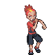
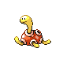

# Important Trainers

### Ace Trainer Slythe

| Pokémon | Attributes | Item | Moves |
|:-------:|------------|:----:|-------|
|  | **Lv. 76** [Gengar](../../pokemon/gengar.md/) **Ability:** Levitate **Nature:** ? |  Wide Lens | 1. Sludge Bomb 2. Shadow Ball 3. Focus Blast 4. Thunder |
|  | **Lv. 76** [Tentacruel](../../pokemon/tentacruel.md/) **Ability:** Clear Body **Nature:** ? |  Black Sludge | 1. Sludge Bomb 2. Muddy Water 3. Ice Beam 4. Toxic Spikes |
|  | **Lv. 76** [Nidoqueen](../../pokemon/nidoqueen.md/) **Ability:** Poison Point **Nature:** ? |  Life Orb | 1. Poison Jab 2. Earthquake 3. Fire Blast 4. Stone Edge |
|  | **Lv. 76** [Crobat](../../pokemon/crobat.md/) **Ability:** Inner Focus **Nature:** ? |  Shell Bell | 1. Cross Poison 2. Brave Bird 3. Hypnosis 4. Leech Life |
|  | **Lv. 76** [Toxicroak](../../pokemon/toxicroak.md/) **Ability:** Dry Skin **Nature:** ? |  Expert Belt | 1. Gunk Shot 2. Drain Punch 3. Sucker Punch 4. Fake Out |
|  | **Lv. 77** [Vileplume](../../pokemon/vileplume.md/) **Ability:** Chlorophyll **Nature:** ? |  Sitrus Berry | 1. Sludge Bomb 2. Petal Dance 3. Moonblast 4. Sleep Powder |

### PKMN Trainer Buck

| Pokémon | Attributes | Item | Moves |
|:-------:|------------|:----:|-------|
|  | **Lv. 77** [Torkoal](../../pokemon/torkoal.md/) **Ability:** Drought **Nature:** ? |  Shuca Berry | 1. Fire Blast 2. Earth Power 3. Solar Beam 4. Stealth Rock |
|  | **Lv. 77** [Shuckle](../../pokemon/shuckle.md/) **Ability:** Sturdy **Nature:** ? |  Lum Berry | 1. Toxic 2. Encore 3. Rest 4. Protect |
|  | **Lv. 77** [Umbreon](../../pokemon/umbreon.md/) **Ability:** Synchronize **Nature:** ? |  Chople Berry | 1. Payback 2. Confuse Ray 3. Toxic 4. Moonlight |
|  | **Lv. 77** [Dusknoir](../../pokemon/dusknoir.md/) **Ability:** Iron Fist (!) **Nature:** ? |  Sitrus Berry | 1. Shadow Punch 2. Confuse Ray 3. Protect 4. Drain Punch |
|  | **Lv. 77** [Cloyster](../../pokemon/cloyster.md/) **Ability:** Skill Link **Nature:** ? |  Expert Belt | 1. Icicle Spear 2. Hydro Pump 3. Spikes 4. Toxic Spikes |
|  | **Lv. 78** [Claydol](../../pokemon/claydol.md/) **Ability:** Levitate **Nature:** ? |  Leftovers | 1. Earth Power 2. Psychic 3. Ice Beam 4. Calm Mind |

