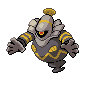

# Important Trainers

### Ace Trainer Slythe

| Pokémon | Attributes | Item | Moves |
|:-------:|------------|:----:|-------|
|  | **Lv. 76** Gengar **Ability:** Levitate ? |  Wide Lens | **1.** Sludge Bomb **2.** Shadow Ball **3.** Focus Blast **4.** Thunder |
|  | **Lv. 76** Tentacruel **Ability:** Clear Body ? |  Black Sludge | **1.** Sludge Bomb **2.** Muddy Water **3.** Ice Beam **4.** Toxic Spikes |
|  | **Lv. 76** Nidoqueen **Ability:** Poison Point ? |  Life Orb | **1.** Poison Jab **2.** Earthquake **3.** Fire Blast **4.** Stone Edge |
|  | **Lv. 76** Crobat **Ability:** Inner Focus ? |  Shell Bell | **1.** Cross Poison **2.** Brave Bird **3.** Hypnosis **4.** Leech Life |
|  | **Lv. 76** Toxicroak **Ability:** Dry Skin ? |  Expert Belt | **1.** Gunk Shot **2.** Drain Punch **3.** Sucker Punch **4.** Fake Out |
|  | **Lv. 77** Vileplume **Ability:** Chlorophyll ? |  Sitrus Berry | **1.** Sludge Bomb **2.** Petal Dance **3.** Moonblast **4.** Sleep Powder |

### PKMN Trainer Buck

| Pokémon | Attributes | Item | Moves |
|:-------:|------------|:----:|-------|
|  | **Lv. 77** Torkoal **Ability:** Drought ? |  Shuca Berry | **1.** Fire Blast **2.** Earth Power **3.** Solar Beam **4.** Stealth Rock |
|  | **Lv. 77** Shuckle **Ability:** Sturdy ? |  Lum Berry | **1.** Toxic **2.** Encore **3.** Rest **4.** Protect |
|  | **Lv. 77** Umbreon **Ability:** Synchronize ? |  Chople Berry | **1.** Payback **2.** Confuse Ray **3.** Toxic **4.** Moonlight |
|  | **Lv. 77** Dusknoir **Ability:** Iron Fist (!) ? |  Sitrus Berry | **1.** Shadow Punch **2.** Confuse Ray **3.** Protect **4.** Drain Punch |
|  | **Lv. 77** Cloyster **Ability:** Skill Link ? |  Expert Belt | **1.** Icicle Spear **2.** Hydro Pump **3.** Spikes **4.** Toxic Spikes |
|  | **Lv. 78** Claydol **Ability:** Levitate ? |  Leftovers | **1.** Earth Power **2.** Psychic **3.** Ice Beam **4.** Calm Mind |

