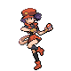

# Trainer Rosters

### Generic Trainers

| Trainer | P1 | P2 | P3 | P4 | P5 | P6 |
|:-------:|:--:|:--:|:--:|:--:|:--:|:--:|
| ](../../assets/trainers/ace_trainer.png "Ace Trainer Saul [(!)](#rematches)") Ace Trainer Saul [(!)](#rematches) |  [Tauros](../../pokemon/tauros.md/) Lv. 78 |
|  PKMN Ranger Felicia |  [Jumpluff](../../pokemon/jumpluff.md/) Lv. 76 |  [Lopunny](../../pokemon/lopunny.md/) Lv. 76 |
|  Black Belt Griffin |  [Breloom](../../pokemon/breloom.md/) Lv. 75 |  [Medicham](../../pokemon/medicham.md/) Lv. 75 |  [Lucario](../../pokemon/lucario.md/) Lv. 75 |
|  Ace Trainer Mikayla |  [Seviper](../../pokemon/seviper.md/) Lv. 76 |  [Persian](../../pokemon/persian.md/) Lv. 76 |  [Absol](../../pokemon/absol.md/) Lv. 76 |
|  Ace Trainer Slythe * |  [Gengar](../../pokemon/gengar.md/) Lv. 76 |  [Tentacruel](../../pokemon/tentacruel.md/) Lv. 76 |  [Nidoqueen](../../pokemon/nidoqueen.md/) Lv. 76 |  [Crobat](../../pokemon/crobat.md/) Lv. 76 |  [Toxicroak](../../pokemon/toxicroak.md/) Lv. 76 |  [Vileplume](../../pokemon/vileplume.md/) Lv. 77 |

### Rematches

| Trainer | P1 | P2 | P3 | P4 | P5 | P6 |
|:-------:|:--:|:--:|:--:|:--:|:--:|:--:|
| ") Ace Trainer Saul (S) |  [Tauros](../../pokemon/tauros.md/) Lv. 80 |

### Important Trainers

1. [Ace Trainer Slythe](important_trainers.md#ace-trainer-slythe)
1. [PKMN Trainer Buck](important_trainers.md#pkmn-trainer-buck)
