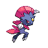

# Important Trainers

### Ace Trainer Shade

| Pokémon | Attributes | Item | Moves |
|:-------:|------------|:----:|-------|
|  | **Lv. 76** [Houndoom](../../pokemon/houndoom.md/) **Ability:** Intimidate (!) **Nature:** ?   |  White Herb | 1. Dark Pulse 2. Overheat 3. Sludge Bomb 4. Thunder Fang |
|  | **Lv. 76** [Weavile](../../pokemon/weavile.md/) **Ability:** Technician (!) **Nature:** ?   |  Muscle Band | 1. Icicle Crash 2. Feint Attack 3. Aerial Ace 4. Low Kick |
|  | **Lv. 76** [Shiftry](../../pokemon/shiftry.md/) **Ability:** Chlorophyll **Nature:** ?   |  Wise Glasses | 1. Energy Ball 2. Dark Pulse 3. Hurricane 4. Focus Blast |
|  | **Lv. 76** [Sharpedo](../../pokemon/sharpedo.md/) **Ability:** Speed Boost **Nature:** ?   |  Expert Belt | 1. Waterfall 2. Crunch 3. Ice Fang 4. Zen Headbutt |
|  | **Lv. 76** [Spiritomb](../../pokemon/spiritomb.md/) **Ability:** Pressure **Nature:** ?   |  Leftovers | 1. Dark Pulse 2. Psychic 3. Hypnosis 4. Double Team |
|  | **Lv. 77** [Tyranitar](../../pokemon/tyranitar.md/) **Ability:** Sand Stream **Nature:** ?   |  Chople Berry | 1. Crunch 2. Stone Edge 3. Iron Tail 4. Fire Punch |

