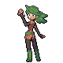

# Important Trainers

### Ace Trainer Shade

| Pokémon | Attributes | Item | Moves |
|:-------:|------------|:----:|-------|
|  | **Lv. 76** Houndoom **Ability:** Intimidate (!) **Nature:** ? |  White Herb | **1.** Dark Pulse **2.** Overheat **3.** Sludge Bomb **4.** Thunder Fang |
|  | **Lv. 76** Weavile **Ability:** Technician (!) **Nature:** ? |  Muscle Band | **1.** Icicle Crash **2.** Feint Attack **3.** Aerial Ace **4.** Low Kick |
|  | **Lv. 76** Shiftry **Ability:** Chlorophyll **Nature:** ? |  Wise Glasses | **1.** Energy Ball **2.** Dark Pulse **3.** Hurricane **4.** Focus Blast |
|  | **Lv. 76** Sharpedo **Ability:** Speed Boost **Nature:** ? |  Expert Belt | **1.** Waterfall **2.** Crunch **3.** Ice Fang **4.** Zen Headbutt |
|  | **Lv. 76** Spiritomb **Ability:** Pressure **Nature:** ? |  Leftovers | **1.** Dark Pulse **2.** Psychic **3.** Hypnosis **4.** Double Team |
|  | **Lv. 77** Tyranitar **Ability:** Sand Stream **Nature:** ? |  Chople Berry | **1.** Crunch **2.** Stone Edge **3.** Iron Tail **4.** Fire Punch |

