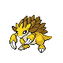
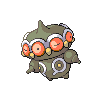
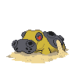

# Route 228 — Wild Pokémon

### Walking

| Sprite | Pokémon | Encounter Type | Level | Chance |
|:------:|---------|:--------------:|-------|--------|
|  | [Cacturne](../../pokemon/cacturne.md/) | {: style='max-width: 24px;' } | 65 - 67 | 20% |
|  | [Sandslash](../../pokemon/sandslash.md/) | {: style='max-width: 24px;' } | 65 - 67 | 20% |
|  | [Dugtrio](../../pokemon/dugtrio.md/) | {: style='max-width: 24px;' } | 65 - 67 | 20% |
|  | [Vibrava](../../pokemon/vibrava.md/) | {: style='max-width: 24px;' } | 65 - 67 | 10% |
|  | [Claydol](../../pokemon/claydol.md/) | {: style='max-width: 24px;' } | 65 - 67 | 10% |
|  | [Hippowdon](../../pokemon/hippowdon.md/) | {: style='max-width: 24px;' } | 65 - 67 | 10% |
|  | [Metang](../../pokemon/metang.md/) | {: style='max-width: 24px;' } | 65 - 67 | 5% |
|  | [Gabite](../../pokemon/gabite.md/) | {: style='max-width: 24px;' } | 65 - 67 | 5% |
|  | [Cacturne](../../pokemon/cacturne.md/) | {: style='max-width: 24px;' } | 65 - 67 | 20% |
|  | [Sandslash](../../pokemon/sandslash.md/) | {: style='max-width: 24px;' } | 65 - 67 | 20% |
|  | [Dugtrio](../../pokemon/dugtrio.md/) | {: style='max-width: 24px;' } | 65 - 67 | 20% |
|  | [Vibrava](../../pokemon/vibrava.md/) | {: style='max-width: 24px;' } | 65 - 67 | 10% |
|  | [Claydol](../../pokemon/claydol.md/) | {: style='max-width: 24px;' } | 65 - 67 | 10% |
|  | [Hippowdon](../../pokemon/hippowdon.md/) | {: style='max-width: 24px;' } | 65 - 67 | 10% |
|  | [Metang](../../pokemon/metang.md/) | {: style='max-width: 24px;' } | 65 - 67 | 5% |
|  | [Gabite](../../pokemon/gabite.md/) | {: style='max-width: 24px;' } | 65 - 67 | 5% |
|  | [Cacturne](../../pokemon/cacturne.md/) | {: style='max-width: 24px;' } | 65 - 67 | 20% |
|  | [Sandslash](../../pokemon/sandslash.md/) | {: style='max-width: 24px;' } | 65 - 67 | 20% |
|  | [Dugtrio](../../pokemon/dugtrio.md/) | {: style='max-width: 24px;' } | 65 - 67 | 20% |
|  | [Vibrava](../../pokemon/vibrava.md/) | {: style='max-width: 24px;' } | 65 - 67 | 10% |
|  | [Claydol](../../pokemon/claydol.md/) | {: style='max-width: 24px;' } | 65 - 67 | 10% |
|  | [Hippowdon](../../pokemon/hippowdon.md/) | {: style='max-width: 24px;' } | 65 - 67 | 10% |
|  | [Metang](../../pokemon/metang.md/) | {: style='max-width: 24px;' } | 65 - 67 | 5% |
|  | [Gabite](../../pokemon/gabite.md/) | {: style='max-width: 24px;' } | 65 - 67 | 5% |

### Surfing

| Sprite | Pokémon | Encounter Type | Level | Chance |
|:------:|---------|:--------------:|-------|--------|
|  | [Poliwhirl](../../pokemon/poliwhirl.md/) | {: style='max-width: 24px;' } | 65 - 67 | 100% |

### Fishing

| Sprite | Pokémon | Encounter Type | Level | Chance |
|:------:|---------|:--------------:|-------|--------|
|  | [Magikarp](../../pokemon/magikarp.md/) | {: style='max-width: 24px;' } | 10 | 65% |
|  | [Barboach](../../pokemon/barboach.md/) | {: style='max-width: 24px;' } | 10 | 35% |
|  | [Magikarp](../../pokemon/magikarp.md/) | {: style='max-width: 24px;' } | 25 | 65% |
|  | [Barboach](../../pokemon/barboach.md/) | {: style='max-width: 24px;' } | 25 | 35% |
|  | [Gyarados](../../pokemon/gyarados.md/) | {: style='max-width: 24px;' } | 50 | 65% |
|  | [Whiscash](../../pokemon/whiscash.md/) | {: style='max-width: 24px;' } | 50 | 35% |

