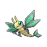
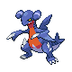

### Walking

| Sprite | Pokémon | Encounter Type | Level | Chance |
|:------:|---------|:--------------:|-------|--------|
|  | Cacturne | {: style='max-width: 24px;' } | 65 - 67 | 20% |
|  | Sandslash | {: style='max-width: 24px;' } | 65 - 67 | 20% |
|  | Dugtrio | {: style='max-width: 24px;' } | 65 - 67 | 20% |
|  | Vibrava | {: style='max-width: 24px;' } | 65 - 67 | 10% |
|  | Claydol | {: style='max-width: 24px;' } | 65 - 67 | 10% |
|  | Hippowdon | {: style='max-width: 24px;' } | 65 - 67 | 10% |
|  | Metang | {: style='max-width: 24px;' } | 65 - 67 | 5% |
|  | Gabite | {: style='max-width: 24px;' } | 65 - 67 | 5% |
|  | Cacturne | {: style='max-width: 24px;' } | 65 - 67 | 20% |
|  | Sandslash | {: style='max-width: 24px;' } | 65 - 67 | 20% |
|  | Dugtrio | {: style='max-width: 24px;' } | 65 - 67 | 20% |
|  | Vibrava | {: style='max-width: 24px;' } | 65 - 67 | 10% |
|  | Claydol | {: style='max-width: 24px;' } | 65 - 67 | 10% |
|  | Hippowdon | {: style='max-width: 24px;' } | 65 - 67 | 10% |
|  | Metang | {: style='max-width: 24px;' } | 65 - 67 | 5% |
|  | Gabite | {: style='max-width: 24px;' } | 65 - 67 | 5% |
|  | Cacturne | {: style='max-width: 24px;' } | 65 - 67 | 20% |
|  | Sandslash | {: style='max-width: 24px;' } | 65 - 67 | 20% |
|  | Dugtrio | {: style='max-width: 24px;' } | 65 - 67 | 20% |
|  | Vibrava | {: style='max-width: 24px;' } | 65 - 67 | 10% |
|  | Claydol | {: style='max-width: 24px;' } | 65 - 67 | 10% |
|  | Hippowdon | {: style='max-width: 24px;' } | 65 - 67 | 10% |
|  | Metang | {: style='max-width: 24px;' } | 65 - 67 | 5% |
|  | Gabite | {: style='max-width: 24px;' } | 65 - 67 | 5% |

### Surfing

| Sprite | Pokémon | Encounter Type | Level | Chance |
|:------:|---------|:--------------:|-------|--------|
|  | Poliwhirl | {: style='max-width: 24px;' } | 65 - 67 | 100% |

### Fishing

| Sprite | Pokémon | Encounter Type | Level | Chance |
|:------:|---------|:--------------:|-------|--------|
|  | Magikarp | {: style='max-width: 24px;' } | 10 | 65% |
|  | Barboach | {: style='max-width: 24px;' } | 10 | 35% |
|  | Magikarp | {: style='max-width: 24px;' } | 25 | 65% |
|  | Barboach | {: style='max-width: 24px;' } | 25 | 35% |
|  | Gyarados | {: style='max-width: 24px;' } | 50 | 65% |
|  | Whiscash | {: style='max-width: 24px;' } | 50 | 35% |

