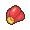

# Important Trainers

### Ace Trainer Gene

| Pokémon | Attributes | Item | Moves |
|:-------:|------------|:----:|-------|
|  | **Lv. 76** Stantler **Ability:** Intimidate ? |  Choice Scarf | **1.** Double-Edge **2.** Jump Kick **3.** Megahorn **4.** Zen Headbutt |
|  | **Lv. 76** Dodrio **Ability:** Tangled Feet ? |  Muscle Band | **1.** Double-Edge **2.** Brave Bird **3.** High Jump Kick **4.** Drill Run |
|  | **Lv. 76** Girafarig **Ability:** Inner Focus ? |  Wise Glasses | **1.** Hyper Voice **2.** Psychic **3.** Thunderbolt **4.** Dazzling Gleam |
|  | **Lv. 76** Bibarel **Ability:** Simple ? |  Chople Berry | **1.** Double-Edge **2.** Aqua Tail **3.** Crunch **4.** Curse |
|  | **Lv. 76** Porygon-Z **Ability:** Adaptability ? |  Life Orb | **1.** Hyper Beam **2.** Thunderbolt **3.** Ice Beam **4.** Psychic |
|  | **Lv. 77** Snorlax **Ability:** Thick Fat ? |  Leftovers | **1.** Body Slam **2.** Earthquake **3.** Curse **4.** Slack Off |

