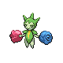

### Walking

| Sprite | Pokémon | Encounter Type | Level | Chance |
|:------:|---------|:--------------:|-------|--------|
|  | [Scyther](../../pokemon/scyther.md/) | {: style='max-width: 24px;' } | 65 - 67 | 20% |
|  | [Pinsir](../../pokemon/pinsir.md/) | {: style='max-width: 24px;' } | 65 - 67 | 20% |
|  | [Ledian](../../pokemon/ledian.md/) | {: style='max-width: 24px;' } | 65 - 67 | 20% |
|  | [Roselia](../../pokemon/roselia.md/) | {: style='max-width: 24px;' } | 65 - 67 | 15% |
|  | [Venomoth](../../pokemon/venomoth.md/) | {: style='max-width: 24px;' } | 65 - 67 | 10% |
|  | [Illumise](../../pokemon/illumise.md/) | {: style='max-width: 24px;' } | 65 - 67 | 5% |
|  | [Volbeat](../../pokemon/volbeat.md/) | {: style='max-width: 24px;' } | 65 - 67 | 5% |
|  | [Weepinbell](../../pokemon/weepinbell.md/) | {: style='max-width: 24px;' } | 65 - 67 | 5% |
|  | [Scyther](../../pokemon/scyther.md/) | {: style='max-width: 24px;' } | 65 - 67 | 20% |
|  | [Pinsir](../../pokemon/pinsir.md/) | {: style='max-width: 24px;' } | 65 - 67 | 20% |
|  | [Sunkern](../../pokemon/sunkern.md/) | {: style='max-width: 24px;' } | 65 - 67 | 20% |
|  | [Roselia](../../pokemon/roselia.md/) | {: style='max-width: 24px;' } | 65 - 67 | 15% |
|  | [Venomoth](../../pokemon/venomoth.md/) | {: style='max-width: 24px;' } | 65 - 67 | 10% |
|  | [Illumise](../../pokemon/illumise.md/) | {: style='max-width: 24px;' } | 65 - 67 | 5% |
|  | [Volbeat](../../pokemon/volbeat.md/) | {: style='max-width: 24px;' } | 65 - 67 | 5% |
|  | [Weepinbell](../../pokemon/weepinbell.md/) | {: style='max-width: 24px;' } | 65 - 67 | 5% |
|  | [Scyther](../../pokemon/scyther.md/) | {: style='max-width: 24px;' } | 65 - 67 | 20% |
|  | [Pinsir](../../pokemon/pinsir.md/) | {: style='max-width: 24px;' } | 65 - 67 | 20% |
|  | [Ariados](../../pokemon/ariados.md/) | {: style='max-width: 24px;' } | 65 - 67 | 20% |
|  | [Roselia](../../pokemon/roselia.md/) | {: style='max-width: 24px;' } | 65 - 67 | 15% |
|  | [Venomoth](../../pokemon/venomoth.md/) | {: style='max-width: 24px;' } | 65 - 67 | 10% |
|  | [Illumise](../../pokemon/illumise.md/) | {: style='max-width: 24px;' } | 65 - 67 | 5% |
|  | [Volbeat](../../pokemon/volbeat.md/) | {: style='max-width: 24px;' } | 65 - 67 | 5% |
|  | [Weepinbell](../../pokemon/weepinbell.md/) | {: style='max-width: 24px;' } | 65 - 67 | 5% |

### Surfing

| Sprite | Pokémon | Encounter Type | Level | Chance |
|:------:|---------|:--------------:|-------|--------|
|  | [Masquerain](../../pokemon/masquerain.md/) | {: style='max-width: 24px;' } | 65 - 67 | 100% |

### Fishing

| Sprite | Pokémon | Encounter Type | Level | Chance |
|:------:|---------|:--------------:|-------|--------|
|  | [Magikarp](../../pokemon/magikarp.md/) | {: style='max-width: 24px;' } | 10 | 65% |
|  | [Goldeen](../../pokemon/goldeen.md/) | {: style='max-width: 24px;' } | 10 | 35% |
|  | [Magikarp](../../pokemon/magikarp.md/) | {: style='max-width: 24px;' } | 25 | 65% |
|  | [Goldeen](../../pokemon/goldeen.md/) | {: style='max-width: 24px;' } | 25 | 35% |
|  | [Gyarados](../../pokemon/gyarados.md/) | {: style='max-width: 24px;' } | 50 | 65% |
|  | [Seaking](../../pokemon/seaking.md/) | {: style='max-width: 24px;' } | 50 | 35% |

