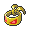

# Important Trainers

### Ace Trainer Luna

| Pokémon | Attributes | Item | Moves |
|:-------:|------------|:----:|-------|
|  | **Lv. 76** [Wigglytuff](../../pokemon/wigglytuff.md/) **Ability:** Cute Charm **Nature:** ? |  Expert Belt | 1. Moonblast 2. Thunderbolt 3. Ice Beam 4. Flamethrower |
|  | **Lv. 76** [Clefable](../../pokemon/clefable.md/) **Ability:** Cute Charm **Nature:** ? |  Leftovers | 1. Moonblast 2. Soft-Boiled 3. Focus Blast 4. Reflect |
|  | **Lv. 76** [Azumarill](../../pokemon/azumarill.md/) **Ability:** Huge Power **Nature:** ? |  White Herb | 1. Play Rough 2. Aqua Tail 3. Superpower 4. Aqua Jet |
|  | **Lv. 76** [Granbull](../../pokemon/granbull.md/) **Ability:** Intimidate **Nature:** ? |  Muscle Band | 1. Play Rough 2. Close Combat 3. Crunch 4. Lovely Kiss |
|  | **Lv. 76** [Mawile](../../pokemon/mawile.md/) **Ability:** Huge Power (!) **Nature:** ? |  Focus Sash | 1. Play Rough 2. Iron Head 3. Sucker Punch 4. Swords Dance |
|  | **Lv. 77** [Gardevoir](../../pokemon/gardevoir.md/) **Ability:** Synchronize **Nature:** ? |  Life Orb | 1. Moonblast 2. Psychic 3. Thunderbolt 4. Aura Sphere |

