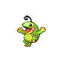
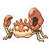
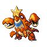
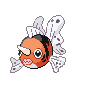
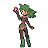
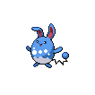

# Route 230 — Trainer Rosters

### Generic Trainers

| Trainer | P1 | P2 | P3 | P4 | P5 | P6 |
|:-------:|:--:|:--:|:--:|:--:|:--:|:--:|
| ") Swimmer Glenn [(!)](#rematches) |  [Octillery](../../pokemon/octillery.md/) Lv. 73 |  [Politoed](../../pokemon/politoed.md/) Lv. 73 |
| ") Swimmer Joanna [(!)](#rematches) |  [Luvdisc](../../pokemon/luvdisc.md/) Lv. 72 |  [Corsola](../../pokemon/corsola.md/) Lv. 72 |  [Vaporeon](../../pokemon/vaporeon.md/) Lv. 72 |
|  Swimmer Kurt |  [Krabby](../../pokemon/krabby.md/) Lv. 70 |  [Corphish](../../pokemon/corphish.md/) Lv. 70 |  [Kingler](../../pokemon/kingler.md/) Lv. 72 |  [Crawdaunt](../../pokemon/crawdaunt.md/) Lv. 72 |
|  Swimmer Sophia |  [Delibird](../../pokemon/delibird.md/) Lv. 73 |  [Mantine](../../pokemon/mantine.md/) Lv. 73 |
|  Swimmer Sam |  [Walrein](../../pokemon/walrein.md/) Lv. 72 |  [Gastrodon](../../pokemon/gastrodon.md/) Lv. 72 |  [Seaking](../../pokemon/seaking.md/) Lv. 72 |
|  Swimmer Mallory |  [Masquerain](../../pokemon/masquerain.md/) Lv. 73 |  [Ludicolo](../../pokemon/ludicolo.md/) Lv. 73 |
|  Ace Trainer Luna * |  [Wigglytuff](../../pokemon/wigglytuff.md/) Lv. 76 |  [Clefable](../../pokemon/clefable.md/) Lv. 76 |  [Azumarill](../../pokemon/azumarill.md/) Lv. 76 |  [Granbull](../../pokemon/granbull.md/) Lv. 76 |  [Mawile](../../pokemon/mawile.md/) Lv. 76 |  [Gardevoir](../../pokemon/gardevoir.md/) Lv. 77 |

### Rematches

| Trainer | P1 | P2 | P3 | P4 | P5 | P6 |
|:-------:|:--:|:--:|:--:|:--:|:--:|:--:|
| ") Swimmer Glenn (S) |  [Octillery](../../pokemon/octillery.md/) Lv. 76 |  [Politoed](../../pokemon/politoed.md/) Lv. 76 |
| ") Swimmer Joanna (S) |  [Luvdisc](../../pokemon/luvdisc.md/) Lv. 75 |  [Corsola](../../pokemon/corsola.md/) Lv. 75 |  [Vaporeon](../../pokemon/vaporeon.md/) Lv. 75 |

### Important Trainers

1. [Ace Trainer Luna](important_trainers.md#ace-trainer-luna)
