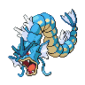

### Walking

| Sprite | Pokémon | Encounter Type | Level | Chance |
|:------:|---------|:--------------:|-------|--------|
|  | Staravia | {: style='max-width: 24px;' } | 53 - 54 | 30% |
|  | Bibarel | {: style='max-width: 24px;' } | 53 - 54 | 20% |
|  | Chimecho | {: style='max-width: 24px;' } | 53 - 54 | 20% |
|  | Solrock | {: style='max-width: 24px;' } | 53 - 54 | 10% |
|  | Lunatone | {: style='max-width: 24px;' } | 53 - 54 | 10% |
|  | Dusclops | {: style='max-width: 24px;' } | 53 - 54 | 10% |
|  | Staravia | {: style='max-width: 24px;' } | 53 - 54 | 30% |
|  | Bibarel | {: style='max-width: 24px;' } | 53 - 54 | 20% |
|  | Chimecho | {: style='max-width: 24px;' } | 53 - 54 | 20% |
|  | Solrock | {: style='max-width: 24px;' } | 53 - 54 | 10% |
|  | Lunatone | {: style='max-width: 24px;' } | 53 - 54 | 10% |
|  | Dusclops | {: style='max-width: 24px;' } | 53 - 54 | 10% |
|  | Staravia | {: style='max-width: 24px;' } | 53 - 54 | 30% |
|  | Bibarel | {: style='max-width: 24px;' } | 53 - 54 | 20% |
|  | Chimecho | {: style='max-width: 24px;' } | 53 - 54 | 20% |
|  | Solrock | {: style='max-width: 24px;' } | 53 - 54 | 10% |
|  | Lunatone | {: style='max-width: 24px;' } | 53 - 54 | 10% |
|  | Dusclops | {: style='max-width: 24px;' } | 53 - 54 | 10% |
|  | Wobbuffet | {: style='max-width: 24px;' } | 53 - 54 | 22% |

### Surfing

| Sprite | Pokémon | Encounter Type | Level | Chance |
|:------:|---------|:--------------:|-------|--------|
|  | Golduck | {: style='max-width: 24px;' } | 45 - 55 | 100% |

### Fishing

| Sprite | Pokémon | Encounter Type | Level | Chance |
|:------:|---------|:--------------:|-------|--------|
|  | Magikarp | {: style='max-width: 24px;' } | 10 | 100% |
|  | Magikarp | {: style='max-width: 24px;' } | 25 | 100% |
|  | Gyarados | {: style='max-width: 24px;' } | 50 | 100% |

