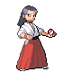
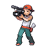

# Seven Stars Restaurant — Trainer Rosters

### Generic Trainers

| Trainer | P1 | P2 | P3 | P4 | P5 | P6 |
|:-------:|:--:|:--:|:--:|:--:|:--:|:--:|
|  Artist Ismael |  [Smeargle](../../pokemon/smeargle.md/) Lv. 37 |
|  Beauty Harley |  [Golduck](../../pokemon/golduck.md/) Lv. 37 |
|  Rich Boy Roman |  [Arcanine](../../pokemon/arcanine.md/) Lv. 37 |
|  Lady Kylie |  [Vileplume](../../pokemon/vileplume.md/) Lv. 37 |
|  Gentleman Leonardo |  [Chatot](../../pokemon/chatot.md/) Lv. 37 |
|  Socialite Rebecca |  [Persian](../../pokemon/persian.md/) Lv. 37 |
|  Collector Eugene |  [Milotic](../../pokemon/milotic.md/) Lv. 37 |
|  Aroma Lady Alison |  [Meganium](../../pokemon/meganium.md/) Lv. 37 |
|  School Kid Esteban |  [Quagsire](../../pokemon/quagsire.md/) Lv. 37 |
|  Pokefan Meredith |  [Pachirisu](../../pokemon/pachirisu.md/) Lv. 37 |
|  Veteran Emanuel |  [Blaziken](../../pokemon/blaziken.md/) Lv. 37 |
|  Lass Blythe |  [Lopunny](../../pokemon/lopunny.md/) Lv. 37 |
|  Cameraman Darryl |  [Magneton](../../pokemon/magneton.md/) Lv. 37 |
|  Reporter Valerie |  [Loudred](../../pokemon/loudred.md/) Lv. 37 |
|  PI Kendrick |  [Rhydon](../../pokemon/rhydon.md/) Lv. 37 |
|  Beauty Gabriella |  [Lumineon](../../pokemon/lumineon.md/) Lv. 37 |
|  Scientist Emilio |  [Alakazam](../../pokemon/alakazam.md/) Lv. 37 |
|  PKMN Breeder Kaylee |  [Azumarill](../../pokemon/azumarill.md/) Lv. 37 |

