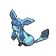
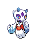

# Important Trainers

---

## Gym

### Leader Candice

| Pokémon | Attributes | Item | Moves |
|:-------:|------------|:----:|-------|
|  | **Lv. 55** Abomasnow **Ability:** Snow Warning **Nature:** Brave |  Expert Belt | **1.** Wood Hammer **2.** Earthquake **3.** Blizzard **4.** Ice Shard |
|  | **Lv. 55** Weavile **Ability:** Technician (!) **Nature:** Naughty |  Focus Sash | **1.** Crunch **2.** Icicle Crash **3.** Aerial Ace **4.** Swords Dance |
|  | **Lv. 55** Glaceon **Ability:** Snow Cloak **Nature:** Bold |  Bright Powder | **1.** Blizzard **2.** Shadow Ball **3.** Earth Power **4.** Double Team |
|  | **Lv. 55** Walrein **Ability:** Thick Fat **Nature:** Quiet |  Chople Berry | **1.** Blizzard **2.** Surf **3.** Yawn **4.** Aqua Ring |
|  | **Lv. 55** Mamoswine **Ability:** Thick Fat **Nature:** Naive |  Passho Berry | **1.** Earthquake **2.** Avalanche **3.** Stone Edge **4.** Ice Shard |
|  | **Lv. 56** Froslass **Ability:** Levitate (!) **Nature:** Modest |  Life Orb | **1.** Blizzard **2.** Shadow Ball **3.** Thunderbolt **4.** Attract |

