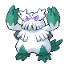
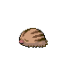

# Trainer Rosters

---

## City

### Generic Trainers

| Trainer | P1 | P2 | P3 | P4 | P5 | P6 |
|:-------:|:--:|:--:|:--:|:--:|:--:|:--:|
|  Ace Trainer Aran |  Heracross Lv. 54 |  Typhlosion Lv. 54 |  Tyranitar Lv. 54 |
|  Ace Trainer Nephenee |  Blissey Lv. 54 |  Meganium Lv. 54 |  Feraligatr Lv. 54 |

---

## Gym

### Generic Trainers

| Trainer | P1 | P2 | P3 | P4 | P5 | P6 |
|:-------:|:--:|:--:|:--:|:--:|:--:|:--:|
|  Ace Trainer Anton |  Snorunt Lv. 51 |  Glalie Lv. 54 |  Glalie Lv. 54 |
|  Ace Trainer Savannah |  Seel Lv. 51 |  Jynx Lv. 54 |  Dewgong Lv. 54 |
|  Ace Trainer Alicia |  Spheal Lv. 51 |  Sealeo Lv. 53 |  Walrein Lv. 55 |
|  Ace Trainer Isaiah |  Abomasnow Lv. 54 |  Delibird Lv. 54 |
|  Ace Trainer Brenna |  Dewgong Lv. 53 |  Cloyster Lv. 53 |  Lapras Lv. 53 |
|  Ace Trainer Sergio |  Swinub Lv. 51 |  Piloswine Lv. 53 |  Mamoswine Lv. 55 |

### Important Trainers

1. [Leader Candice](important_trainers.md#leader-candice)
