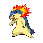

# Trainer Rosters

---

## Generic Trainers

| Trainer | P1 | P2 | P3 | P4 | P5 | P6 |
|:-------:|:--:|:--:|:--:|:--:|:--:|:--:|
|  Ace Trainer Aran |  Heracross Lv. 54 |  Typhlosion Lv. 54 |  Tyranitar Lv. 54 |
|  Ace Trainer Nephenee |  Blissey Lv. 54 |  Meganium Lv. 54 |  Feraligatr Lv. 54 |
