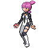

# Important Trainers

### Commander Mars

| Pokémon | Attributes | Item | Moves |
|:-------:|------------|:----:|-------|
|  | **Lv. 57** Crobat **Ability:** Inner Focus **Nature:** ? |  Life Orb | **1.** Brave Bird **2.** Sludge Bomb **3.** Confuse Ray **4.** Torment |
|  | **Lv. 57** Yanmega **Ability:** Speed Boost **Nature:** ? |  Wise Glasses | **1.** Bug Buzz **2.** Hurricane **3.** Shadow Ball **4.** Detect |
|  | **Lv. 57** Bronzong **Ability:** Levitate **Nature:** ? |  Leftovers | **1.** Stealth Rock **2.** Zen Headbutt **3.** Gyro Ball **4.** Earthquake |
|  | **Lv. 57** Electivire **Ability:** Motor Drive **Nature:** ? |  Expert Belt | **1.** Thunder Punch **2.** Ice Punch **3.** Cross Chop **4.** Fire Punch |
|  | **Lv. 57** Kangaskhan **Ability:** Scrappy **Nature:** ? |  Muscle Band | **1.** Body Slam **2.** Crunch **3.** Hammer Arm **4.** Fake Out |
|  | **Lv. 58** Purugly **Ability:** Thick Fat **Nature:** ? |  Sitrus Berry | **1.** Body Slam **2.** Play Rough **3.** Fake Out **4.** Hypnosis |

### Commander Jupiter

| Pokémon | Attributes | Item | Moves |
|:-------:|------------|:----:|-------|
|  | **Lv. 57** Crobat **Ability:** Inner Focus **Nature:** ? |  Bright Powder | **1.** Brave Bird **2.** Sludge Bomb **3.** Double Team **4.** Hypnosis |
|  | **Lv. 57** Sableye **Ability:** Magic Guard (!) **Nature:** ? |  Muscle Band | **1.** Shadow Claw **2.** Sucker Punch **3.** Zen Headbutt **4.** Fake Out |
|  | **Lv. 57** Bronzong **Ability:** Levitate **Nature:** ? |  Leftovers | **1.** Swagger **2.** Psychic **3.** Flash Cannon **4.** Grass Knot |
|  | **Lv. 57** Tangrowth **Ability:** Chlorophyll **Nature:** ? |  Big Root | **1.** Giga Drain **2.** Leech Seed **3.** Focus Blast **4.** Sludge Bomb |
|  | **Lv. 57** Gastrodon **Ability:** Sticky Hold **Nature:** ? |  Wise Glasses | **1.** Muddy Water **2.** Earth Power **3.** Ice Beam **4.** Recover |
|  | **Lv. 58** Skuntank **Ability:** Aftermath **Nature:** ? |  Sitrus Berry | **1.** Gunk Shot **2.** Crunch **3.** Play Rough **4.** Toxic |

