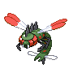
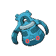
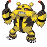
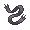
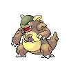
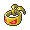
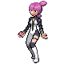
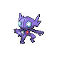
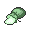
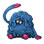

# Important Trainers

---

## Entrance

### Commander Mars

| Pokémon | Attributes | Item | Moves |
|:-------:|------------|:----:|-------|
|  | **Lv. 77** Crobat **Ability:** Inner Focus **Nature:** ? |  Life Orb | 1. Brave Bird 2. Sludge Bomb 3. Giga Drain 4. Hypnosis |
|  | **Lv. 77** Yanmega **Ability:** Speed Boost **Nature:** ? |  Wise Glasses | 1. Bug Buzz 2. Air Slash 3. Psychic 4. Detect |
|  | **Lv. 77** Bronzong **Ability:** Levitate **Nature:** ? |  Leftovers | 1. Gyro Ball 2. Zen Headbutt 3. Earthquake 4. Rock Slide |
|  | **Lv. 77** Electivire **Ability:** Motor Drive **Nature:** ? |  Expert Belt | 1. Wild Charge 2. Ice Punch 3. Cross Chop 4. Fire Punch |
|  | **Lv. 77** Kangaskhan **Ability:** Scrappy **Nature:** ? |  Muscle Band | 1. Body Slam 2. Crunch 3. Hammer Arm 4. Fake Out |
|  | **Lv. 78** Purugly **Ability:** Thick Fat **Nature:** ? |  Sitrus Berry | 1. Body Slam 2. Play Rough 3. Fake Out 4. Hypnosis |

### Commander Jupiter

| Pokémon | Attributes | Item | Moves |
|:-------:|------------|:----:|-------|
|  | **Lv. 77** Bronzong **Ability:** Levitate **Nature:** ? |  Leftovers | 1. Swagger 2. Psychic 3. Flash Cannon 4. Grass Knot |
|  | **Lv. 77** Sableye **Ability:** Magic Guard (!) **Nature:** ? |  Muscle Band | 1. Shadow Claw 2. Sucker Punch 3. Zen Headbutt 4. Fake Out |
|  | **Lv. 77** Crobat **Ability:** Inner Focus **Nature:** ? |  Bright Powder | 1. Hurricane 2. Sludge Bomb 3. Double Team 4. Hypnosis |
|  | **Lv. 77** Tangrowth **Ability:** Chlorophyll **Nature:** ? |  White Herb | 1. Leaf Storm 2. Earthquake 3. Focus Blast 4. Sludge Bomb |
|  | **Lv. 77** Gastrodon **Ability:** Sticky Hold **Nature:** ? |  Wise Glasses | 1. Muddy Water 2. Earth Power 3. Ice Beam 4. Recover |
|  | **Lv. 78** Skuntank **Ability:** Aftermath **Nature:** ? |  Sitrus Berry | 1. Gunk Shot 2. Crunch 3. Play Rough 4. Toxic |

