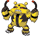
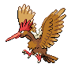

# Stark Mountain — Trainer Rosters

---

## Outside

### Generic Trainers

| Trainer | P1 | P2 | P3 | P4 | P5 | P6 |
|:-------:|:--:|:--:|:--:|:--:|:--:|:--:|
|  Dragon Tamer Darien |  [Dragonite](../../pokemon/dragonite.md/) Lv. 78 |

---

## Entrance

### Important Trainers

1. [Commander Mars](important_trainers.md#commander-mars)
1. [Commander Jupiter](important_trainers.md#commander-jupiter)

---

## Interior

### Generic Trainers

| Trainer | P1 | P2 | P3 | P4 | P5 | P6 |
|:-------:|:--:|:--:|:--:|:--:|:--:|:--:|
|  Ace Trainer Keenan |  [Primeape](../../pokemon/primeape.md/) Lv. 78 |  [Banette](../../pokemon/banette.md/) Lv. 78 |  [Electivire](../../pokemon/electivire.md/) Lv. 78 |
|  Ace Trainer Kassandra |  [Jumpluff](../../pokemon/jumpluff.md/) Lv. 78 |  [Ampharos](../../pokemon/ampharos.md/) Lv. 78 |  [Steelix](../../pokemon/steelix.md/) Lv. 78 |
|  Ace Trainer Stefan |  [Tyranitar](../../pokemon/tyranitar.md/) Lv. 78 |  [Torterra](../../pokemon/torterra.md/) Lv. 78 |  [Aggron](../../pokemon/aggron.md/) Lv. 78 |
|  Ace Trainer Jasmin |  [Drapion](../../pokemon/drapion.md/) Lv. 78 |  [Hippowdon](../../pokemon/hippowdon.md/) Lv. 78 |  [Magmortar](../../pokemon/magmortar.md/) Lv. 78 |
|  Bird Keeper Krystal |  [Staraptor](../../pokemon/staraptor.md/) Lv. 78 |  [Fearow](../../pokemon/fearow.md/) Lv. 78 |  [Noctowl](../../pokemon/noctowl.md/) Lv. 78 |
|  Black Belt Ray |  [Breloom](../../pokemon/breloom.md/) Lv. 78 |  [Toxicroak](../../pokemon/toxicroak.md/) Lv. 78 |  [Hariyama](../../pokemon/hariyama.md/) Lv. 78 |
|  Ace Trainer Abel |  [Glalie](../../pokemon/glalie.md/) Lv. 78 |  [Crobat](../../pokemon/crobat.md/) Lv. 78 |  [Ninetales](../../pokemon/ninetales.md/) Lv. 78 |
|  Ace Trainer Monique |  [Luxray](../../pokemon/luxray.md/) Lv. 78 |  [Ursaring](../../pokemon/ursaring.md/) Lv. 78 |  [Gliscor](../../pokemon/gliscor.md/) Lv. 78 |
|  Psychic Chelsey |  [Lunatone](../../pokemon/lunatone.md/) Lv. 78 |  [Gardevoir](../../pokemon/gardevoir.md/) Lv. 78 |  [Xatu](../../pokemon/xatu.md/) Lv. 78 |
|  Psychic Sterling |  [Solrock](../../pokemon/solrock.md/) Lv. 78 |  [Gallade](../../pokemon/gallade.md/) Lv. 78 |  [Claydol](../../pokemon/claydol.md/) Lv. 78 |
|  Veteran Harlan |  [Raticate](../../pokemon/raticate.md/) Lv. 78 |  [Drifblim](../../pokemon/drifblim.md/) Lv. 78 |  [Shiftry](../../pokemon/shiftry.md/) Lv. 78 |
|  Dragon Tamer Kenny |  [Salamence](../../pokemon/salamence.md/) Lv. 78 |  [Flygon](../../pokemon/flygon.md/) Lv. 78 |  [Altaria](../../pokemon/altaria.md/) Lv. 78 |
|  Ace Trainer Skylar |  [Exploud](../../pokemon/exploud.md/) Lv. 78 |  [Rampardos](../../pokemon/rampardos.md/) Lv. 78 |  [Pelipper](../../pokemon/pelipper.md/) Lv. 78 |
|  Ace Trainer Natasha |  [Wigglytuff](../../pokemon/wigglytuff.md/) Lv. 78 |  [Alakazam](../../pokemon/alakazam.md/) Lv. 78 |  [Medicham](../../pokemon/medicham.md/) Lv. 78 |
|  Dragon Tamer Drake |  [Garchomp](../../pokemon/garchomp.md/) Lv. 78 |  [Dragonite](../../pokemon/dragonite.md/) Lv. 78 |  [Kingdra](../../pokemon/kingdra.md/) Lv. 78 |
|  Black Belt Jarrett |  [Machamp](../../pokemon/machamp.md/) Lv. 78 |  [Blaziken](../../pokemon/blaziken.md/) Lv. 78 |  [Poliwrath](../../pokemon/poliwrath.md/) Lv. 78 |

