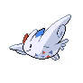
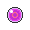

# Important Trainers

---

## City

### Arcade Star Dahlia

| Pokémon | Attributes | Item | Moves |
|:-------:|------------|:----:|-------|
|  | **Lv. 63** [Blaziken](../../pokemon/blaziken.md/) **Ability:** Speed Boost **Nature:** ?   |  Focus Sash | 1. Swords Dance 2. Baton Pass 3. High Jump Kick 4. Blaze Kick |
|  | **Lv. 63** [Dusknoir](../../pokemon/dusknoir.md/) **Ability:** Iron Fist (!) **Nature:** ?  |  Lum Berry | 1. Shadow Punch 2. Thunder Punch 3. Ice Punch 4. Drain Punch |
|  | **Lv. 63** [Medicham](../../pokemon/medicham.md/) **Ability:** Pure Power **Nature:** ?   |  Choice Scarf | 1. High Jump Kick 2. Zen Headbutt 3. Ice Punch 4. Fire Punch |
|  | **Lv. 63** [Togekiss](../../pokemon/togekiss.md/) **Ability:** Serene Grace **Nature:** ?   |  Wise Glasses | 1. Hurricane 2. Moonblast 3. Aura Sphere 4. Flamethrower |
|  | **Lv. 63** [Ludicolo](../../pokemon/ludicolo.md/) **Ability:** Swift Swim **Nature:** ?   |  Life Orb | 1. Hydro Pump 2. Giga Drain 3. Ice Beam 4. Fake Out |
|  | **Lv. 63** [Zapdos](../../pokemon/zapdos.md/) **Ability:** Pressure **Nature:** ?   |  Sitrus Berry | 1. Thunderbolt 2. Heat Wave 3. Drill Peck 4. Light Screen |

---

## Gym

### Leader Volkner

| Pokémon | Attributes | Item | Moves |
|:-------:|------------|:----:|-------|
|  | **Lv. 61** [Jolteon](../../pokemon/jolteon.md/) **Ability:** Static **Nature:** Naive  |  Focus Sash | 1. Thunderbolt 2. Shadow Ball 3. Grass Knot 4. Thunder Wave |
|  | **Lv. 61** [Raichu](../../pokemon/raichu.md/) **Ability:** Static **Nature:** Timid  |  Expert Belt | 1. Thunderbolt 2. Grass Knot 3. Focus Blast 4. Surf |
|  | **Lv. 61** [Rotom](../../pokemon/rotom.md/) **Ability:** Levitate **Nature:** Modest   |  Sitrus Berry | 1. Thunderbolt 2. Hydro Pump 3. Shadow Ball 4. Thunder Wave |
|  | **Lv. 61** [Rotom](../../pokemon/rotom.md/) **Ability:** Levitate **Nature:** Modest   |  White Herb | 1. Thunderbolt 2. Overheat 3. Shadow Ball 4. Will-O-Wisp |
|  | **Lv. 61** [Luxray](../../pokemon/luxray.md/) **Ability:** Intimidate **Nature:** Naughty   |  Choice Band | 1. Wild Charge 2. Crunch 3. Ice Fang 4. Fire Fang |
|  | **Lv. 62** [Electivire](../../pokemon/electivire.md/) **Ability:** Motor Drive **Nature:** Jolly   |  Life Orb | 1. Wild Charge 2. Close Combat 3. Ice Punch 4. Earthquake |

