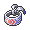

# Important Trainers

---

## City

### Arcade Star Dahlia

| Pokémon | Attributes | Item | Moves |
|:-------:|------------|:----:|-------|
|  | **Lv. 63** Blaziken **Ability:** Speed Boost **Nature:** ? |  Focus Sash | **1.** Swords Dance **2.** Baton Pass **3.** High Jump Kick **4.** Blaze Kick |
|  | **Lv. 63** Dusknoir **Ability:** Iron Fist (!) **Nature:** ? |  Lum Berry | **1.** Shadow Punch **2.** Thunder Punch **3.** Ice Punch **4.** Drain Punch |
|  | **Lv. 63** Medicham **Ability:** Pure Power **Nature:** ? |  Choice Scarf | **1.** High Jump Kick **2.** Zen Headbutt **3.** Ice Punch **4.** Fire Punch |
|  | **Lv. 63** Togekiss **Ability:** Serene Grace **Nature:** ? |  Wise Glasses | **1.** Hurricane **2.** Moonblast **3.** Aura Sphere **4.** Flamethrower |
|  | **Lv. 63** Ludicolo **Ability:** Swift Swim **Nature:** ? |  Life Orb | **1.** Hydro Pump **2.** Giga Drain **3.** Ice Beam **4.** Fake Out |
|  | **Lv. 63** Zapdos **Ability:** Pressure **Nature:** ? |  Sitrus Berry | **1.** Thunderbolt **2.** Heat Wave **3.** Drill Peck **4.** Light Screen |

---

## Gym

### Leader Volkner

| Pokémon | Attributes | Item | Moves |
|:-------:|------------|:----:|-------|
|  | **Lv. 61** Jolteon **Ability:** Static **Nature:** Naive |  Focus Sash | **1.** Thunderbolt **2.** Shadow Ball **3.** Grass Knot **4.** Thunder Wave |
|  | **Lv. 61** Raichu **Ability:** Static **Nature:** Timid |  Expert Belt | **1.** Thunderbolt **2.** Grass Knot **3.** Focus Blast **4.** Surf |
|  | **Lv. 61** Rotom **Ability:** Levitate **Nature:** Modest |  Sitrus Berry | **1.** Thunderbolt **2.** Hydro Pump **3.** Shadow Ball **4.** Thunder Wave |
|  | **Lv. 61** Rotom **Ability:** Levitate **Nature:** Modest |  White Herb | **1.** Thunderbolt **2.** Overheat **3.** Shadow Ball **4.** Will-O-Wisp |
|  | **Lv. 61** Luxray **Ability:** Intimidate **Nature:** Naughty |  Choice Band | **1.** Wild Charge **2.** Crunch **3.** Ice Fang **4.** Fire Fang |
|  | **Lv. 62** Electivire **Ability:** Motor Drive **Nature:** Jolly |  Life Orb | **1.** Wild Charge **2.** Close Combat **3.** Ice Punch **4.** Earthquake |

