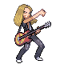

# Trainer Rosters

---

## City

### Important Trainers

1. [Arcade Star Dahlia](important_trainers.md#arcade-star-dahlia)

---

## Gym

### Generic Trainers

| Trainer | P1 | P2 | P3 | P4 | P5 | P6 |
|:-------:|:--:|:--:|:--:|:--:|:--:|:--:|
|  School Kid Tiera |  [Plusle](../../pokemon/plusle.md/) Lv. 56 |  [Minun](../../pokemon/minun.md/) Lv. 56 |  [Pachirisu](../../pokemon/pachirisu.md/) Lv. 59 |
|  School Kid Forrest |  [Elekid](../../pokemon/elekid.md/) Lv. 56 |  [Elekid](../../pokemon/elekid.md/) Lv. 56 |  [Electabuzz](../../pokemon/electabuzz.md/) Lv. 59 |
|  Guitarist Jerry |  [Electabuzz](../../pokemon/electabuzz.md/) Lv. 60 |  [Luxray](../../pokemon/luxray.md/) Lv. 60 |
|  Poke Kid Meghan |  [Pichu](../../pokemon/pichu.md/) Lv. 56 |  [Pichu](../../pokemon/pichu.md/) Lv. 56 |  [Pikachu](../../pokemon/pikachu.md/) Lv. 59 |
|  Ace Trainer Destiny |  [Raichu](../../pokemon/raichu.md/) Lv. 60 |  [Lanturn](../../pokemon/lanturn.md/) Lv. 60 |  [Jolteon](../../pokemon/jolteon.md/) Lv. 60 |  [Luxray](../../pokemon/luxray.md/) Lv. 60 |
|  Guitarist Preston |  [Electabuzz](../../pokemon/electabuzz.md/) Lv. 60 |  [Magnezone](../../pokemon/magnezone.md/) Lv. 60 |
|  Guitarist Lonnie |  [Electabuzz](../../pokemon/electabuzz.md/) Lv. 60 |  [Electrode](../../pokemon/electrode.md/) Lv. 60 |
|  Ace Trainer Zachery |  [Ampharos](../../pokemon/ampharos.md/) Lv. 60 |  [Magnezone](../../pokemon/magnezone.md/) Lv. 60 |  [Manectric](../../pokemon/manectric.md/) Lv. 60 |  [Electrode](../../pokemon/electrode.md/) Lv. 60 |

### Important Trainers

1. [Leader Volkner](important_trainers.md#leader-volkner)
