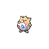

### Walking

| Sprite | Pokémon | Encounter Type | Level | Chance |
|:------:|---------|:--------------:|-------|--------|
|  | [Pichu](../../pokemon/pichu.md/) | {: style='max-width: 24px;' } | 24 - 26 | 20% |
|  | [Pikachu](../../pokemon/pikachu.md/) | {: style='max-width: 24px;' } | 24 - 26 | 20% |
|  | [Cleffa](../../pokemon/cleffa.md/) | {: style='max-width: 24px;' } | 24 - 26 | 10% |
|  | [Igglybuff](../../pokemon/igglybuff.md/) | {: style='max-width: 24px;' } | 24 - 26 | 10% |
|  | [Togepi](../../pokemon/togepi.md/) | {: style='max-width: 24px;' } | 24 - 26 | 10% |
|  | [Porygon](../../pokemon/porygon.md/) | {: style='max-width: 24px;' } | 24 - 26 | 10% |
|  | [Happiny](../../pokemon/happiny.md/) | {: style='max-width: 24px;' } | 24 - 26 | 10% |
|  | [Eevee](../../pokemon/eevee.md/) | {: style='max-width: 24px;' } | 24 - 26 | 10% |
|  | [Pichu](../../pokemon/pichu.md/) | {: style='max-width: 24px;' } | 24 - 26 | 20% |
|  | [Pikachu](../../pokemon/pikachu.md/) | {: style='max-width: 24px;' } | 24 - 26 | 20% |
|  | [Cleffa](../../pokemon/cleffa.md/) | {: style='max-width: 24px;' } | 24 - 26 | 10% |
|  | [Igglybuff](../../pokemon/igglybuff.md/) | {: style='max-width: 24px;' } | 24 - 26 | 10% |
|  | [Togepi](../../pokemon/togepi.md/) | {: style='max-width: 24px;' } | 24 - 26 | 10% |
|  | [Porygon](../../pokemon/porygon.md/) | {: style='max-width: 24px;' } | 24 - 26 | 10% |
|  | [Happiny](../../pokemon/happiny.md/) | {: style='max-width: 24px;' } | 24 - 26 | 10% |
|  | [Eevee](../../pokemon/eevee.md/) | {: style='max-width: 24px;' } | 24 - 26 | 10% |
|  | [Pichu](../../pokemon/pichu.md/) | {: style='max-width: 24px;' } | 24 - 26 | 20% |
|  | [Pikachu](../../pokemon/pikachu.md/) | {: style='max-width: 24px;' } | 24 - 26 | 20% |
|  | [Cleffa](../../pokemon/cleffa.md/) | {: style='max-width: 24px;' } | 24 - 26 | 10% |
|  | [Igglybuff](../../pokemon/igglybuff.md/) | {: style='max-width: 24px;' } | 24 - 26 | 10% |
|  | [Togepi](../../pokemon/togepi.md/) | {: style='max-width: 24px;' } | 24 - 26 | 10% |
|  | [Porygon](../../pokemon/porygon.md/) | {: style='max-width: 24px;' } | 24 - 26 | 10% |
|  | [Happiny](../../pokemon/happiny.md/) | {: style='max-width: 24px;' } | 24 - 26 | 10% |
|  | [Eevee](../../pokemon/eevee.md/) | {: style='max-width: 24px;' } | 24 - 26 | 10% |
|  | [Castform](../../pokemon/castform.md/) | {: style='max-width: 24px;' } | 24 - 26 | 22% |

