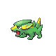

# Valley Windworks — Wild Pokémon

### Walking

| Sprite | Pokémon | Encounter Type | Level | Chance |
|:------:|---------|:--------------:|-------|--------|
|  | [Magnemite](../../pokemon/magnemite.md/) | {: style='max-width: 24px;' } | 11 - 13 | 20% |
|  | [Elekid](../../pokemon/elekid.md/) | {: style='max-width: 24px;' } | 11 - 13 | 20% |
|  | [Electrike](../../pokemon/electrike.md/) | {: style='max-width: 24px;' } | 11 - 13 | 20% |
|  | [Voltorb](../../pokemon/voltorb.md/) | {: style='max-width: 24px;' } | 11 - 13 | 20% |
|  | [Drifloon](../../pokemon/drifloon.md/) | {: style='max-width: 24px;' } | 11 - 13 | 10% |
|  | [Pachirisu](../../pokemon/pachirisu.md/) | {: style='max-width: 24px;' } | 11 - 13 | 10% |
|  | [Magnemite](../../pokemon/magnemite.md/) | {: style='max-width: 24px;' } | 11 - 13 | 20% |
|  | [Elekid](../../pokemon/elekid.md/) | {: style='max-width: 24px;' } | 11 - 13 | 20% |
|  | [Electrike](../../pokemon/electrike.md/) | {: style='max-width: 24px;' } | 11 - 13 | 20% |
|  | [Voltorb](../../pokemon/voltorb.md/) | {: style='max-width: 24px;' } | 11 - 13 | 20% |
|  | [Drifloon](../../pokemon/drifloon.md/) | {: style='max-width: 24px;' } | 11 - 13 | 10% |
|  | [Pachirisu](../../pokemon/pachirisu.md/) | {: style='max-width: 24px;' } | 11 - 13 | 10% |
|  | [Magnemite](../../pokemon/magnemite.md/) | {: style='max-width: 24px;' } | 11 - 13 | 20% |
|  | [Elekid](../../pokemon/elekid.md/) | {: style='max-width: 24px;' } | 11 - 13 | 20% |
|  | [Electrike](../../pokemon/electrike.md/) | {: style='max-width: 24px;' } | 11 - 13 | 20% |
|  | [Voltorb](../../pokemon/voltorb.md/) | {: style='max-width: 24px;' } | 11 - 13 | 20% |
|  | [Drifloon](../../pokemon/drifloon.md/) | {: style='max-width: 24px;' } | 11 - 13 | 10% |
|  | [Pachirisu](../../pokemon/pachirisu.md/) | {: style='max-width: 24px;' } | 11 - 13 | 10% |
|  | [Plusle](../../pokemon/plusle.md/) | {: style='max-width: 24px;' } | 11 - 13 | 11% |
|  | [Minun](../../pokemon/minun.md/) | {: style='max-width: 24px;' } | 11 - 13 | 11% |

### Surfing

| Sprite | Pokémon | Encounter Type | Level | Chance |
|:------:|---------|:--------------:|-------|--------|
|  | [Shellos](../../pokemon/shellos.md/) | {: style='max-width: 24px;' } | 20 - 40 | 60% |
|  | [Tentacool](../../pokemon/tentacool.md/) | {: style='max-width: 24px;' } | 20 - 40 | 30% |
|  | [Gastrodon](../../pokemon/gastrodon.md/) | {: style='max-width: 24px;' } | 20 - 40 | 5% |
|  | [Tentacruel](../../pokemon/tentacruel.md/) | {: style='max-width: 24px;' } | 20 - 40 | 5% |

### Fishing

| Sprite | Pokémon | Encounter Type | Level | Chance |
|:------:|---------|:--------------:|-------|--------|
|  | [Magikarp](../../pokemon/magikarp.md/) | {: style='max-width: 24px;' } | 10 | 60% |
|  | [Shellder](../../pokemon/shellder.md/) | {: style='max-width: 24px;' } | 10 | 30% |
|  | [Chinchou](../../pokemon/chinchou.md/) | {: style='max-width: 24px;' } | 10 | 10% |
|  | [Magikarp](../../pokemon/magikarp.md/) | {: style='max-width: 24px;' } | 25 | 60% |
|  | [Shellder](../../pokemon/shellder.md/) | {: style='max-width: 24px;' } | 25 | 30% |
|  | [Chinchou](../../pokemon/chinchou.md/) | {: style='max-width: 24px;' } | 25 | 10% |
|  | [Gyarados](../../pokemon/gyarados.md/) | {: style='max-width: 24px;' } | 50 | 60% |
|  | [Cloyster](../../pokemon/cloyster.md/) | {: style='max-width: 24px;' } | 50 | 30% |
|  | [Lanturn](../../pokemon/lanturn.md/) | {: style='max-width: 24px;' } | 50 | 10% |

### Honey Tree

| Sprite | Pokémon | Encounter Type | Level | Chance |
|:------:|---------|:--------------:|-------|--------|
|  | [Aipom](../../pokemon/aipom.md/) | {: style='max-width: 24px;' } | 12 | 30% |
|  | [Slakoth](../../pokemon/slakoth.md/) | {: style='max-width: 24px;' } | 12 | 20% |
|  | [Caterpie](../../pokemon/caterpie.md/) | {: style='max-width: 24px;' } | 12 | 20% |
|  | [Weedle](../../pokemon/weedle.md/) | {: style='max-width: 24px;' } | 12 | 20% |
|  | [Munchlax](../../pokemon/munchlax.md/) | {: style='max-width: 24px;' } | 12 | 10% |

