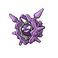

### Walking

| Sprite | Pokémon | Encounter Type | Level | Chance |
|:------:|---------|:--------------:|-------|--------|
|  | Magnemite | {: style='max-width: 24px;' } | 11 - 13 | 20% |
|  | Elekid | {: style='max-width: 24px;' } | 11 - 13 | 20% |
|  | Electrike | {: style='max-width: 24px;' } | 11 - 13 | 20% |
|  | Voltorb | {: style='max-width: 24px;' } | 11 - 13 | 20% |
|  | Drifloon | {: style='max-width: 24px;' } | 11 - 13 | 10% |
|  | Pachirisu | {: style='max-width: 24px;' } | 11 - 13 | 10% |
|  | Magnemite | {: style='max-width: 24px;' } | 11 - 13 | 20% |
|  | Elekid | {: style='max-width: 24px;' } | 11 - 13 | 20% |
|  | Electrike | {: style='max-width: 24px;' } | 11 - 13 | 20% |
|  | Voltorb | {: style='max-width: 24px;' } | 11 - 13 | 20% |
|  | Drifloon | {: style='max-width: 24px;' } | 11 - 13 | 10% |
|  | Pachirisu | {: style='max-width: 24px;' } | 11 - 13 | 10% |
|  | Magnemite | {: style='max-width: 24px;' } | 11 - 13 | 20% |
|  | Elekid | {: style='max-width: 24px;' } | 11 - 13 | 20% |
|  | Electrike | {: style='max-width: 24px;' } | 11 - 13 | 20% |
|  | Voltorb | {: style='max-width: 24px;' } | 11 - 13 | 20% |
|  | Drifloon | {: style='max-width: 24px;' } | 11 - 13 | 10% |
|  | Pachirisu | {: style='max-width: 24px;' } | 11 - 13 | 10% |
|  | Plusle | {: style='max-width: 24px;' } | 11 - 13 | 11% |
|  | Minun | {: style='max-width: 24px;' } | 11 - 13 | 11% |

### Surfing

| Sprite | Pokémon | Encounter Type | Level | Chance |
|:------:|---------|:--------------:|-------|--------|
|  | Shellos | {: style='max-width: 24px;' } | 20 - 40 | 60% |
|  | Tentacool | {: style='max-width: 24px;' } | 20 - 40 | 30% |
|  | Gastrodon | {: style='max-width: 24px;' } | 20 - 40 | 5% |
|  | Tentacruel | {: style='max-width: 24px;' } | 20 - 40 | 5% |

### Fishing

| Sprite | Pokémon | Encounter Type | Level | Chance |
|:------:|---------|:--------------:|-------|--------|
|  | Magikarp | {: style='max-width: 24px;' } | 10 | 60% |
|  | Shellder | {: style='max-width: 24px;' } | 10 | 30% |
|  | Chinchou | {: style='max-width: 24px;' } | 10 | 10% |
|  | Magikarp | {: style='max-width: 24px;' } | 25 | 60% |
|  | Shellder | {: style='max-width: 24px;' } | 25 | 30% |
|  | Chinchou | {: style='max-width: 24px;' } | 25 | 10% |
|  | Gyarados | {: style='max-width: 24px;' } | 50 | 60% |
|  | Cloyster | {: style='max-width: 24px;' } | 50 | 30% |
|  | Lanturn | {: style='max-width: 24px;' } | 50 | 10% |

### Honey Tree

| Sprite | Pokémon | Encounter Type | Level | Chance |
|:------:|---------|:--------------:|-------|--------|
|  | Aipom | {: style='max-width: 24px;' } | 12 | 30% |
|  | Slakoth | {: style='max-width: 24px;' } | 12 | 20% |
|  | Caterpie | {: style='max-width: 24px;' } | 12 | 20% |
|  | Weedle | {: style='max-width: 24px;' } | 12 | 20% |
|  | Munchlax | {: style='max-width: 24px;' } | 12 | 10% |

