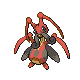

### Morning

| Sprite | Pokémon | Encounter Type | Level | Chance |
|:------:|---------|:--------------:|-------|--------|
|  | Girafarig | {: style='max-width: 24px;' } | 31 - 33 | 30% |
|  | Bibarel | {: style='max-width: 24px;' } | 31 - 33 | 20% |
|  | Nidorina | {: style='max-width: 24px;' } | 31 - 33 | 20% |
|  | Nidorino | {: style='max-width: 24px;' } | 31 - 33 | 20% |
|  | Kricketune | {: style='max-width: 24px;' } | 31 - 33 | 10% |

### Day

| Sprite | Pokémon | Encounter Type | Level | Chance |
|:------:|---------|:--------------:|-------|--------|
|  | Girafarig | {: style='max-width: 24px;' } | 31 - 33 | 30% |
|  | Bibarel | {: style='max-width: 24px;' } | 31 - 33 | 20% |
|  | Nidorina | {: style='max-width: 24px;' } | 31 - 33 | 20% |
|  | Nidorino | {: style='max-width: 24px;' } | 31 - 33 | 20% |
|  | Kricketune | {: style='max-width: 24px;' } | 31 - 33 | 10% |

### Night

| Sprite | Pokémon | Encounter Type | Level | Chance |
|:------:|---------|:--------------:|-------|--------|
|  | Girafarig | {: style='max-width: 24px;' } | 31 - 33 | 30% |
|  | Bibarel | {: style='max-width: 24px;' } | 31 - 33 | 20% |
|  | Nidorina | {: style='max-width: 24px;' } | 31 - 33 | 20% |
|  | Nidorino | {: style='max-width: 24px;' } | 31 - 33 | 20% |
|  | Kricketune | {: style='max-width: 24px;' } | 31 - 33 | 10% |

### Poke Radar

| Sprite | Pokémon | Encounter Type | Level | Chance |
|:------:|---------|:--------------:|-------|--------|
|  | Venomoth | {: style='max-width: 24px;' } | ? | 22% |

