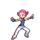

# Important Trainers

---

## Gym

### Leader Maylene

| Pokémon | Attributes | Item | Moves |
|:-------:|------------|:----:|-------|
|  | **Lv. 38** [Medicham](../../pokemon/medicham.md/) **Ability:** Pure Power **Nature:** Naive   |  Sitrus Berry | 1. High Jump Kick 2. Zen Headbutt 3. Ice Punch 4. Fake Out |
|  | **Lv. 38** [Machamp](../../pokemon/machamp.md/) **Ability:** Guts **Nature:** Relaxed  |  Toxic Orb | 1. Close Combat 2. Payback 3. Thunder Punch 4. Protect |
|  | **Lv. 38** [Infernape](../../pokemon/infernape.md/) **Ability:** Iron Fist **Nature:** Hasty   |  Life Orb | 1. Close Combat 2. Rock Slide 3. Fire Punch 4. Mach Punch |
|  | **Lv. 38** [Toxicroak](../../pokemon/toxicroak.md/) **Ability:** Dry Skin **Nature:** Lonely   |  Big Root | 1. Drain Punch 2. Poison Jab 3. Ice Punch 4. Sucker Punch |
|  | **Lv. 38** [Gallade](../../pokemon/gallade.md/) **Ability:** Steadfast **Nature:** Brave   |  Light Clay | 1. Drain Punch 2. Zen Headbutt 3. Light Screen 4. Reflect |
|  | **Lv. 39** [Lucario](../../pokemon/lucario.md/) **Ability:** Adaptability (!) **Nature:** Timid   |  Focus Sash | 1. Aura Sphere 2. Flash Cannon 3. Dark Pulse 4. Agility |

