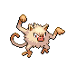

# Veilstone City — Trainer Rosters

---

## City

### Generic Trainers

| Trainer | P1 | P2 | P3 | P4 | P5 | P6 |
|:-------:|:--:|:--:|:--:|:--:|:--:|:--:|
|  Dragon Tamer Nils |  [Dragonair](../../pokemon/dragonair.md/) Lv. 35 |  [Shelgon](../../pokemon/shelgon.md/) Lv. 35 |  [Vibrava](../../pokemon/vibrava.md/) Lv. 35 |  [Kingdra](../../pokemon/kingdra.md/) Lv. 36 |
|  Team Galactic Grunt |  [Weezing](../../pokemon/weezing.md/) Lv. 35 |  [Golbat](../../pokemon/golbat.md/) Lv. 35 |  [Venomoth](../../pokemon/venomoth.md/) Lv. 35 |
|  Team Galactic Grunt |  [Skuntank](../../pokemon/skuntank.md/) Lv. 35 |  [Dustox](../../pokemon/dustox.md/) Lv. 35 |  [Wormadam](../../pokemon/wormadam-plant.md/) Lv. 35 |

---

## Gym

### Generic Trainers

| Trainer | P1 | P2 | P3 | P4 | P5 | P6 |
|:-------:|:--:|:--:|:--:|:--:|:--:|:--:|
|  Black Belt Colby |  [Machop](../../pokemon/machop.md/) Lv. 33 |  [Meditite](../../pokemon/meditite.md/) Lv. 33 |  [Croagunk](../../pokemon/croagunk.md/) Lv. 33 |  [Mankey](../../pokemon/mankey.md/) Lv. 33 |  [Makuhita](../../pokemon/makuhita.md/) Lv. 33 |
|  Black Belt Darren |  [Primeape](../../pokemon/primeape.md/) Lv. 35 |  [Hariyama](../../pokemon/hariyama.md/) Lv. 35 |  [Breloom](../../pokemon/breloom.md/) Lv. 35 |
|  Black Belt Jeffery |  [Heracross](../../pokemon/heracross.md/) Lv. 36 |  [Poliwrath](../../pokemon/poliwrath.md/) Lv. 36 |
|  Black Belt Rafael |  [Hitmonchan](../../pokemon/hitmonchan.md/) Lv. 35 |  [Hitmonlee](../../pokemon/hitmonlee.md/) Lv. 35 |  [Hitmontop](../../pokemon/hitmontop.md/) Lv. 35 |

### Important Trainers

1. [Leader Maylene](important_trainers.md#leader-maylene)
