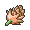

# Victory Road — Important Trainers

---

## East

### PKMN Trainer Marley

| Pokémon | Attributes | Item | Moves |
|:-------:|------------|:----:|-------|
|  | **Lv. 65** [Starmie](../../pokemon/starmie.md/) **Ability:** Illuminate **Nature:** ?   |  Expert Belt | 1. Hydro Pump 2. Blizzard 3. Thunder 4. Psychic |
|  | **Lv. 65** [Electrode](../../pokemon/electrode.md/) **Ability:** Soundproof **Nature:** ?  |  Light Clay | 1. Thunderbolt 2. Thunder Wave 3. Light Screen 4. Explosion |
|  | **Lv. 65** [Sceptile](../../pokemon/sceptile.md/) **Ability:** Unburden **Nature:** ?   |  Petaya Berry | 1. Energy Ball 2. Dragon Pulse 3. Focus Blast 4. Endure |
|  | **Lv. 65** [Crobat](../../pokemon/crobat.md/) **Ability:** Inner Focus **Nature:** ?   |  Bright Powder | 1. Brave Bird 2. Cross Poison 3. Hypnosis 4. Roost |
|  | **Lv. 65** [Weavile](../../pokemon/weavile.md/) **Ability:** Technician **Nature:** ?   |  Life Orb | 1. Crunch 2. Icicle Crash 3. Aerial Ace 4. Low Kick |
|  | **Lv. 66** [Arcanine](../../pokemon/arcanine.md/) **Ability:** Intimidate **Nature:** ?  |  Sitrus Berry | 1. Flare Blitz 2. Close Combat 3. Crunch 4. Extreme Speed |

