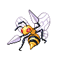

# Trainer Rosters

### Generic Trainers

| Trainer | P1 | P2 | P3 | P4 | P5 | P6 |
|:-------:|:--:|:--:|:--:|:--:|:--:|:--:|
|  Psychic Bryce |  Gengar Lv. 63 |  Gardevoir Lv. 63 |  Exeggutor Lv. 63 |  Espeon Lv. 63 |
|  Bird Keeper Hana |  Noctowl Lv. 63 |  Dodrio Lv. 63 |  Farfetch'd Lv. 63 |  Pidgeot Lv. 63 |
|  Ace Trainer Mariah |  Blissey Lv. 63 |  Walrein Lv. 63 |  Aggron Lv. 63 |  Jumpluff Lv. 63 |  Mismagius Lv. 63 |
|  Ace Trainer Omar |  Rapidash Lv. 63 |  Tropius Lv. 63 |  Rampardos Lv. 63 |  Heracross Lv. 63 |  Mamoswine Lv. 63 |
|  Ace Trainer Sydney |  Clefable Lv. 63 |  Torterra Lv. 63 |  Starmie Lv. 63 |  Magcargo Lv. 63 |  Tauros Lv. 63 |
|  Veteran Clayton |  Lickilicky Lv. 64 |  Hippowdon Lv. 64 |  Staraptor Lv. 64 |  Pinsir Lv. 64 |  Electivire Lv. 64 |
|  Double Team Al & Kay |  Whiscash Lv. 64 |  Ambipom Lv. 64 |  Umbreon Lv. 64 |  Venusaur Lv. 64 |
|  Black Belt Miles |  Machamp Lv. 63 |  Poliwrath Lv. 63 |  Hitmonchan Lv. 63 |  Hitmonlee Lv. 63 |
|  Psychic Valencia |  Chimecho Lv. 63 |  Dusknoir Lv. 63 |  Absol Lv. 63 |  Grumpig Lv. 63 |
|  Double Team Jo & Pat |  Medicham Lv. 64 |  Milotic Lv. 64 |  Ninetales Lv. 64 |  Victreebel Lv. 64 |
|  Ace Trainer Henry |  Honchkrow Lv. 63 |  Marowak Lv. 63 |  Carnivine Lv. 63 |  Manectric Lv. 63 |  Slowking Lv. 63 |
|  Dragon Tamer Ondrej |  Kingdra Lv. 64 |  Altaria Lv. 64 |  Salamence Lv. 64 |  Charizard Lv. 64 |
|  Veteran Edgar |  Porygon-Z Lv. 64 |  Tangrowth Lv. 64 |  Empoleon Lv. 64 |  Golem Lv. 64 |  Typhlosion Lv. 64 |
|  Dragon Tamer Clinton |  Flygon Lv. 64 |  Gyarados Lv. 64 |  Dragonite Lv. 64 |  Aerodactyl Lv. 64 |

---

## East

### Generic Trainers

| Trainer | P1 | P2 | P3 | P4 | P5 | P6 |
|:-------:|:--:|:--:|:--:|:--:|:--:|:--:|
|  Ace Trainer Micah |  Metagross Lv. 65 |  Ludicolo Lv. 65 |  Blaziken Lv. 65 |
|  Ace Trainer Brandi |  Nidoqueen Lv. 65 |  Kangaskhan Lv. 65 |  Jynx Lv. 65 |
|  Psychic Desiree |  Mr. Mime Lv. 64 |  Drifblim Lv. 64 |  Hypno Lv. 64 |
|  Psychic Landon |  Banette Lv. 64 |  Alakazam Lv. 64 |  Girafarig Lv. 64 |
|  Black Belt Eddie |  Primeape Lv. 64 |  Breloom Lv. 64 |  Infernape Lv. 64 |
|  Veteran Terrell |  Parasect Lv. 66 |  Quagsire Lv. 66 |  Houndoom Lv. 66 |
|  Dragon Tamer Joe |  Dragonair Lv. 65 |  Salamence Lv. 65 |  Kingdra Lv. 65 |
|  Bird Keeper Autumn |  Xatu Lv. 64 |  Pelipper Lv. 64 |  Delibird Lv. 64 |
|  Psychic Deandre |  Dusclops Lv. 64 |  Sableye Lv. 64 |  Dusknoir Lv. 64 |
|  Psychic Kendra |  Chimecho Lv. 64 |  Froslass Lv. 64 |  Wobbuffet Lv. 64 |
|  Black Belt Willie |  Heracross Lv. 64 |  Machamp Lv. 64 |  Toxicroak Lv. 64 |
|  Veteran Brenden |  Forretress Lv. 66 |  Kabutops Lv. 66 |  Donphan Lv. 66 |
|  Ace Trainer Arthur |  Gastrodon Lv. 64 |  Beedrill Lv. 64 |  Ampharos Lv. 64 |
|  Ace Trainer Clarice |  Swalot Lv. 64 |  Ninetales Lv. 64 |  Scizor Lv. 64 |

