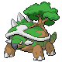
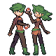
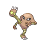

# Victory Road — Trainer Rosters

### Generic Trainers

| Trainer | P1 | P2 | P3 | P4 | P5 | P6 |
|:-------:|:--:|:--:|:--:|:--:|:--:|:--:|
|  Psychic Bryce |  [Gengar](../../pokemon/gengar.md/) Lv. 63 |  [Gardevoir](../../pokemon/gardevoir.md/) Lv. 63 |  [Exeggutor](../../pokemon/exeggutor.md/) Lv. 63 |  [Espeon](../../pokemon/espeon.md/) Lv. 63 |
|  Bird Keeper Hana |  [Noctowl](../../pokemon/noctowl.md/) Lv. 63 |  [Dodrio](../../pokemon/dodrio.md/) Lv. 63 |  [Farfetch'd](../../pokemon/farfetchd.md/) Lv. 63 |  [Pidgeot](../../pokemon/pidgeot.md/) Lv. 63 |
|  Ace Trainer Mariah |  [Blissey](../../pokemon/blissey.md/) Lv. 63 |  [Walrein](../../pokemon/walrein.md/) Lv. 63 |  [Aggron](../../pokemon/aggron.md/) Lv. 63 |  [Jumpluff](../../pokemon/jumpluff.md/) Lv. 63 |  [Mismagius](../../pokemon/mismagius.md/) Lv. 63 |
|  Ace Trainer Omar |  [Rapidash](../../pokemon/rapidash.md/) Lv. 63 |  [Tropius](../../pokemon/tropius.md/) Lv. 63 |  [Rampardos](../../pokemon/rampardos.md/) Lv. 63 |  [Heracross](../../pokemon/heracross.md/) Lv. 63 |  [Mamoswine](../../pokemon/mamoswine.md/) Lv. 63 |
|  Ace Trainer Sydney |  [Clefable](../../pokemon/clefable.md/) Lv. 63 |  [Torterra](../../pokemon/torterra.md/) Lv. 63 |  [Starmie](../../pokemon/starmie.md/) Lv. 63 |  [Magcargo](../../pokemon/magcargo.md/) Lv. 63 |  [Tauros](../../pokemon/tauros.md/) Lv. 63 |
|  Veteran Clayton |  [Lickilicky](../../pokemon/lickilicky.md/) Lv. 64 |  [Hippowdon](../../pokemon/hippowdon.md/) Lv. 64 |  [Staraptor](../../pokemon/staraptor.md/) Lv. 64 |  [Pinsir](../../pokemon/pinsir.md/) Lv. 64 |  [Electivire](../../pokemon/electivire.md/) Lv. 64 |
|  Double Team Al & Kay |  [Whiscash](../../pokemon/whiscash.md/) Lv. 64 |  [Ambipom](../../pokemon/ambipom.md/) Lv. 64 |  [Umbreon](../../pokemon/umbreon.md/) Lv. 64 |  [Venusaur](../../pokemon/venusaur.md/) Lv. 64 |
|  Black Belt Miles |  [Machamp](../../pokemon/machamp.md/) Lv. 63 |  [Poliwrath](../../pokemon/poliwrath.md/) Lv. 63 |  [Hitmonchan](../../pokemon/hitmonchan.md/) Lv. 63 |  [Hitmonlee](../../pokemon/hitmonlee.md/) Lv. 63 |
|  Psychic Valencia |  [Chimecho](../../pokemon/chimecho.md/) Lv. 63 |  [Dusknoir](../../pokemon/dusknoir.md/) Lv. 63 |  [Absol](../../pokemon/absol.md/) Lv. 63 |  [Grumpig](../../pokemon/grumpig.md/) Lv. 63 |
|  Double Team Jo & Pat |  [Medicham](../../pokemon/medicham.md/) Lv. 64 |  [Milotic](../../pokemon/milotic.md/) Lv. 64 |  [Ninetales](../../pokemon/ninetales.md/) Lv. 64 |  [Victreebel](../../pokemon/victreebel.md/) Lv. 64 |
|  Ace Trainer Henry |  [Honchkrow](../../pokemon/honchkrow.md/) Lv. 63 |  [Marowak](../../pokemon/marowak.md/) Lv. 63 |  [Carnivine](../../pokemon/carnivine.md/) Lv. 63 |  [Manectric](../../pokemon/manectric.md/) Lv. 63 |  [Slowking](../../pokemon/slowking.md/) Lv. 63 |
|  Dragon Tamer Ondrej |  [Kingdra](../../pokemon/kingdra.md/) Lv. 64 |  [Altaria](../../pokemon/altaria.md/) Lv. 64 |  [Salamence](../../pokemon/salamence.md/) Lv. 64 |  [Charizard](../../pokemon/charizard.md/) Lv. 64 |
|  Veteran Edgar |  [Porygon-Z](../../pokemon/porygon-z.md/) Lv. 64 |  [Tangrowth](../../pokemon/tangrowth.md/) Lv. 64 |  [Empoleon](../../pokemon/empoleon.md/) Lv. 64 |  [Golem](../../pokemon/golem.md/) Lv. 64 |  [Typhlosion](../../pokemon/typhlosion.md/) Lv. 64 |
|  Dragon Tamer Clinton |  [Flygon](../../pokemon/flygon.md/) Lv. 64 |  [Gyarados](../../pokemon/gyarados.md/) Lv. 64 |  [Dragonite](../../pokemon/dragonite.md/) Lv. 64 |  [Aerodactyl](../../pokemon/aerodactyl.md/) Lv. 64 |

---

## East

### Generic Trainers

| Trainer | P1 | P2 | P3 | P4 | P5 | P6 |
|:-------:|:--:|:--:|:--:|:--:|:--:|:--:|
|  Ace Trainer Micah |  [Metagross](../../pokemon/metagross.md/) Lv. 65 |  [Ludicolo](../../pokemon/ludicolo.md/) Lv. 65 |  [Blaziken](../../pokemon/blaziken.md/) Lv. 65 |
|  Ace Trainer Brandi |  [Nidoqueen](../../pokemon/nidoqueen.md/) Lv. 65 |  [Kangaskhan](../../pokemon/kangaskhan.md/) Lv. 65 |  [Jynx](../../pokemon/jynx.md/) Lv. 65 |
|  Psychic Desiree |  [Mr. Mime](../../pokemon/mr-mime.md/) Lv. 64 |  [Drifblim](../../pokemon/drifblim.md/) Lv. 64 |  [Hypno](../../pokemon/hypno.md/) Lv. 64 |
|  Psychic Landon |  [Banette](../../pokemon/banette.md/) Lv. 64 |  [Alakazam](../../pokemon/alakazam.md/) Lv. 64 |  [Girafarig](../../pokemon/girafarig.md/) Lv. 64 |
|  Black Belt Eddie |  [Primeape](../../pokemon/primeape.md/) Lv. 64 |  [Breloom](../../pokemon/breloom.md/) Lv. 64 |  [Infernape](../../pokemon/infernape.md/) Lv. 64 |
|  Veteran Terrell |  [Parasect](../../pokemon/parasect.md/) Lv. 66 |  [Quagsire](../../pokemon/quagsire.md/) Lv. 66 |  [Houndoom](../../pokemon/houndoom.md/) Lv. 66 |
|  Dragon Tamer Joe |  [Dragonair](../../pokemon/dragonair.md/) Lv. 65 |  [Salamence](../../pokemon/salamence.md/) Lv. 65 |  [Kingdra](../../pokemon/kingdra.md/) Lv. 65 |
|  Bird Keeper Autumn |  [Xatu](../../pokemon/xatu.md/) Lv. 64 |  [Pelipper](../../pokemon/pelipper.md/) Lv. 64 |  [Delibird](../../pokemon/delibird.md/) Lv. 64 |
|  Psychic Deandre |  [Dusclops](../../pokemon/dusclops.md/) Lv. 64 |  [Sableye](../../pokemon/sableye.md/) Lv. 64 |  [Dusknoir](../../pokemon/dusknoir.md/) Lv. 64 |
|  Psychic Kendra |  [Chimecho](../../pokemon/chimecho.md/) Lv. 64 |  [Froslass](../../pokemon/froslass.md/) Lv. 64 |  [Wobbuffet](../../pokemon/wobbuffet.md/) Lv. 64 |
|  Black Belt Willie |  [Heracross](../../pokemon/heracross.md/) Lv. 64 |  [Machamp](../../pokemon/machamp.md/) Lv. 64 |  [Toxicroak](../../pokemon/toxicroak.md/) Lv. 64 |
|  Veteran Brenden |  [Forretress](../../pokemon/forretress.md/) Lv. 66 |  [Kabutops](../../pokemon/kabutops.md/) Lv. 66 |  [Donphan](../../pokemon/donphan.md/) Lv. 66 |
|  Ace Trainer Arthur |  [Gastrodon](../../pokemon/gastrodon.md/) Lv. 64 |  [Beedrill](../../pokemon/beedrill.md/) Lv. 64 |  [Ampharos](../../pokemon/ampharos.md/) Lv. 64 |
|  Ace Trainer Clarice |  [Swalot](../../pokemon/swalot.md/) Lv. 64 |  [Ninetales](../../pokemon/ninetales.md/) Lv. 64 |  [Scizor](../../pokemon/scizor.md/) Lv. 64 |

### Important Trainers

1. [PKMN Trainer Marley](important_trainers.md#pkmn-trainer-marley)
