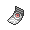

# Important Trainers

### PKMN Trainer Mira

| Pokémon | Attributes | Item | Moves |
|:-------:|------------|:----:|-------|
|  | **Lv. 27** Togetic **Ability:** Serene Grace **Nature:** Modest |  Sitrus Berry | **1.** Dazzling Gleam **2.** Air Cutter **3.** Soft-Boiled **4.** Sweet Kiss |
|  | **Lv. 27** Haunter **Ability:** Levitate **Nature:** Hasty |  Spell Tag | **1.** Shadow Ball **2.** Double Team **3.** Hypnosis **4.** Curse |
|  | **Lv. 27** Porygon2 **Ability:** Trace **Nature:** Calm |  Expert Belt | **1.** Tri Attack **2.** Charge Beam **3.** Signal Beam **4.** Recover |
|  | **Lv. 28** Kadabra **Ability:** Magic Guard **Nature:** Modest |  Life Orb | **1.** Psybeam **2.** Grass Knot **3.** Dazzling Gleam **4.** Recover |

