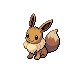

# Wayward Cave — Trainer Rosters

### Generic Trainers

| Trainer | P1 | P2 | P3 | P4 | P5 | P6 |
|:-------:|:--:|:--:|:--:|:--:|:--:|:--:|
|  Hiker Reginald |  [Dugtrio](../../pokemon/dugtrio.md/) Lv. 26 |
|  Hiker Lorenzo |  [Rhyhorn](../../pokemon/rhyhorn.md/) Lv. 25 |  [Sudowoodo](../../pokemon/sudowoodo.md/) Lv. 25 |
|  Lass Cassidy |  [Skitty](../../pokemon/skitty.md/) Lv. 24 |  [Meowth](../../pokemon/meowth.md/) Lv. 24 |  [Eevee](../../pokemon/eevee.md/) Lv. 24 |
|  Youngster Wayne |  [Loudred](../../pokemon/loudred.md/) Lv. 25 |  [Raticate](../../pokemon/raticate.md/) Lv. 25 |
|  Picnicker Tori |  [Psyduck](../../pokemon/psyduck.md/) Lv. 25 |  [Nidorina](../../pokemon/nidorina.md/) Lv. 25 |
|  Camper Diego |  [Aipom](../../pokemon/aipom.md/) Lv. 25 |  [Nidorino](../../pokemon/nidorino.md/) Lv. 25 |
|  Picnicker Ana |  [Illumise](../../pokemon/illumise.md/) Lv. 25 |  [Furret](../../pokemon/furret.md/) Lv. 25 |
|  Camper Parker |  [Volbeat](../../pokemon/volbeat.md/) Lv. 25 |  [Linoone](../../pokemon/linoone.md/) Lv. 25 |
|  Collector Terry |  [Gible](../../pokemon/gible.md/) Lv. 24 |  [Bagon](../../pokemon/bagon.md/) Lv. 24 |  [Gabite](../../pokemon/gabite.md/) Lv. 24 |
|  Ruin Maniac Gerald |  [Cubone](../../pokemon/cubone.md/) Lv. 25 |  [Probopass](../../pokemon/probopass.md/) Lv. 25 |

### Important Trainers

1. [PKMN Trainer Mira](important_trainers.md#pkmn-trainer-mira)
